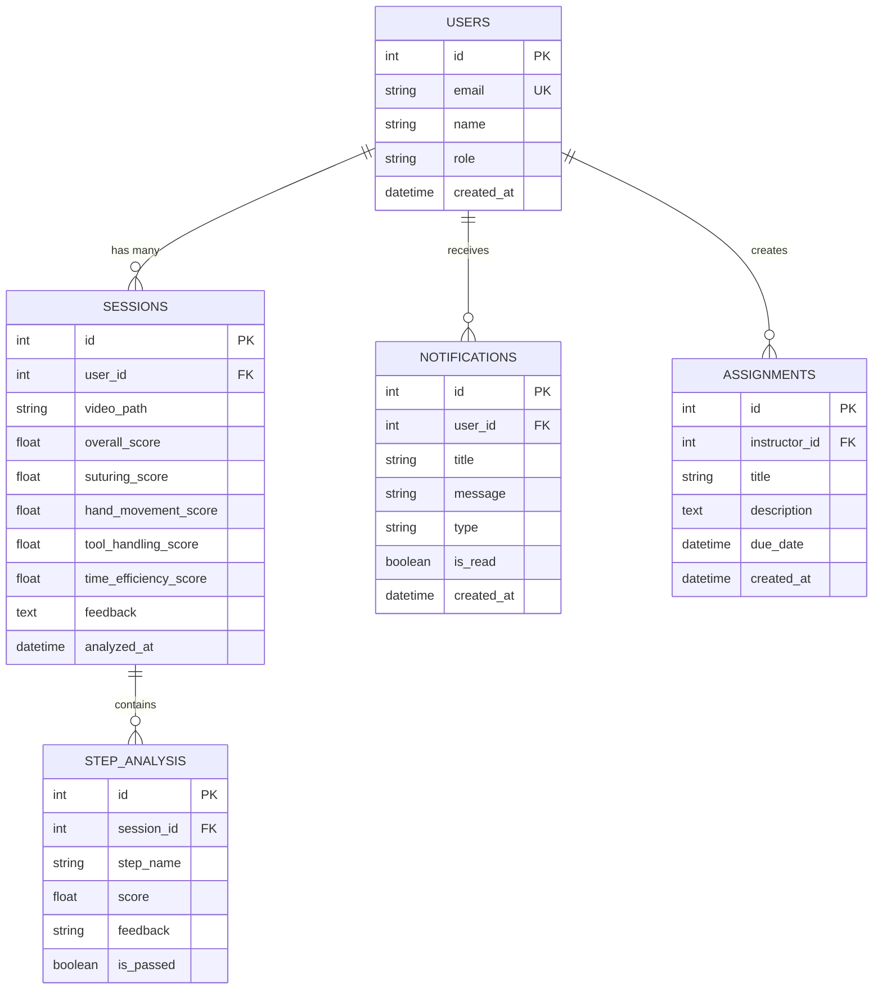
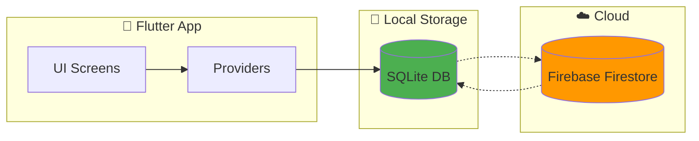

# SSID App - Database Design Documentation

## 📊 Database Architecture

* [ ]

1. **SQLite** - ฐานข้อมูลภายในเครื่อง (Offline First)
2. **Firebase Firestore** - ฐานข้อมูลออนไลน์ (Cloud Sync)

---

## 1. ER Diagram (Entity-Relationship)



---

## 2. Database Tables Schema

### 2.1 Table: `users`

| Column     | Type    | Constraints                | Description                                 |
| ---------- | ------- | -------------------------- | ------------------------------------------- |
| id         | INTEGER | PRIMARY KEY, AUTOINCREMENT | รหัสผู้ใช้                        |
| email      | TEXT    | NOT NULL, UNIQUE           | อีเมล (ใช้ login)                   |
| name       | TEXT    | NOT NULL                   | ชื่อผู้ใช้                        |
| role       | TEXT    | NOT NULL                   | บทบาท: 'Student' หรือ 'Instructor' |
| created_at | TEXT    | DEFAULT CURRENT_TIMESTAMP  | วันที่สร้าง                      |

```sql
CREATE TABLE users (
    id INTEGER PRIMARY KEY AUTOINCREMENT,
    email TEXT NOT NULL UNIQUE,
    name TEXT NOT NULL,
    role TEXT NOT NULL,
    created_at TEXT DEFAULT CURRENT_TIMESTAMP
);
```

### 2.2 Table: `sessions`

| Column                | Type    | Constraints                | Description                                |
| --------------------- | ------- | -------------------------- | ------------------------------------------ |
| id                    | INTEGER | PRIMARY KEY, AUTOINCREMENT | รหัส session                           |
| user_id               | INTEGER | FOREIGN KEY → users(id)   | รหัสผู้ใช้                       |
| video_path            | TEXT    | NOT NULL                   | path ของไฟล์วิดีโอ            |
| overall_score         | REAL    | NOT NULL                   | คะแนนรวม (0-100)                   |
| suturing_score        | REAL    |                            | คะแนนเทคนิคการเย็บ       |
| hand_movement_score   | REAL    |                            | คะแนนการเคลื่อนไหวมือ |
| tool_handling_score   | REAL    |                            | คะแนนการใช้เครื่องมือ |
| time_efficiency_score | REAL    |                            | คะแนนประสิทธิภาพเวลา   |
| feedback              | TEXT    |                            | Feedback จาก AI                         |
| analyzed_at           | TEXT    | DEFAULT CURRENT_TIMESTAMP  | วันเวลาที่วิเคราะห์     |

```sql
CREATE TABLE sessions (
    id INTEGER PRIMARY KEY AUTOINCREMENT,
    user_id INTEGER NOT NULL,
    video_path TEXT NOT NULL,
    overall_score REAL NOT NULL,
    suturing_score REAL,
    hand_movement_score REAL,
    tool_handling_score REAL,
    time_efficiency_score REAL,
    feedback TEXT,
    analyzed_at TEXT DEFAULT CURRENT_TIMESTAMP,
    FOREIGN KEY (user_id) REFERENCES users(id)
);
```

### 2.3 Table: `notifications`

| Column     | Type    | Constraints                | Description                                                           |
| ---------- | ------- | -------------------------- | --------------------------------------------------------------------- |
| id         | INTEGER | PRIMARY KEY, AUTOINCREMENT | รหัสแจ้งเตือน                                            |
| user_id    | INTEGER | FOREIGN KEY → users(id)   | รหัสผู้ใช้                                                  |
| title      | TEXT    | NOT NULL                   | หัวข้อแจ้งเตือน                                        |
| message    | TEXT    | NOT NULL                   | เนื้อหา                                                        |
| type       | TEXT    | NOT NULL                   | ประเภท: result, assignment, alert, info                         |
| is_read    | INTEGER | DEFAULT 0                  | สถานะการอ่าน (0=ยังไม่อ่าน, 1=อ่านแล้ว) |
| created_at | TEXT    | DEFAULT CURRENT_TIMESTAMP  | วันเวลาที่สร้าง                                        |

```sql
CREATE TABLE notifications (
    id INTEGER PRIMARY KEY AUTOINCREMENT,
    user_id INTEGER NOT NULL,
    title TEXT NOT NULL,
    message TEXT NOT NULL,
    type TEXT NOT NULL,
    is_read INTEGER DEFAULT 0,
    created_at TEXT DEFAULT CURRENT_TIMESTAMP,
    FOREIGN KEY (user_id) REFERENCES users(id)
);
```

### 2.4 Table: `assignments`

| Column        | Type    | Constraints                | Description                            |
| ------------- | ------- | -------------------------- | -------------------------------------- |
| id            | INTEGER | PRIMARY KEY, AUTOINCREMENT | รหัสงาน                         |
| instructor_id | INTEGER | FOREIGN KEY → users(id)   | รหัสอาจารย์ผู้สร้าง |
| title         | TEXT    | NOT NULL                   | ชื่องาน                         |
| description   | TEXT    |                            | รายละเอียดงาน             |
| due_date      | TEXT    |                            | กำหนดส่ง                       |
| created_at    | TEXT    | DEFAULT CURRENT_TIMESTAMP  | วันที่สร้าง                 |

```sql
CREATE TABLE assignments (
    id INTEGER PRIMARY KEY AUTOINCREMENT,
    instructor_id INTEGER NOT NULL,
    title TEXT NOT NULL,
    description TEXT,
    due_date TEXT,
    created_at TEXT DEFAULT CURRENT_TIMESTAMP,
    FOREIGN KEY (instructor_id) REFERENCES users(id)
);
```

---

## 3. Database ↔ Screen Relationships

| หน้าจอ                 | ตาราง                               | CRUD Operations                                    | คำอธิบาย                                                                         |
| ---------------------------- | ---------------------------------------- | -------------------------------------------------- | ---------------------------------------------------------------------------------------- |
| **Login Screen**       | `users`                                | **C**reate, **R**ead                   | สร้างผู้ใช้ใหม่ หรือ ดึงข้อมูลผู้ใช้ที่มีอยู่ |
| **Student Home**       | `sessions`                             | **R**ead                                     | แสดง recent analysis history                                                         |
| **Instructor Home**    | `sessions`, `users`                  | **R**ead                                     | แสดงงานที่นักศึกษาส่ง และสถิติ                              |
| **Upload Screen**      | `sessions`                             | **C**reate                                   | บันทึกผลการวิเคราะห์ใหม่                                         |
| **Analysis Results**   | `sessions`                             | **R**ead                                     | แสดงผลการวิเคราะห์                                                     |
| **Notifications**      | `notifications`                        | **R**ead, **U**pdate, **D**elete | อ่าน, ทำเครื่องหมายว่าอ่านแล้ว, ลบ                         |
| **Create Assignment**  | `assignments`, `notifications`       | **C**reate                                   | สร้างงานใหม่ พร้อมแจ้งเตือนนักศึกษา                    |
| **Instructor Profile** | `users`, `sessions`, `assignments` | **R**ead                                     | แสดงสถิติอาจารย์                                                         |

---

## 4. CRUD Operations Mapping

### 4.1 SQLite CRUD (Offline)

```dart
// File: lib/services/database_helper.dart

// === CREATE ===
Future<int> createUser(Map<String, dynamic> user);
Future<int> createSession(Map<String, dynamic> session);
Future<int> createNotification(Map<String, dynamic> notification);
Future<int> createAssignment(Map<String, dynamic> assignment);

// === READ ===
Future<Map<String, dynamic>?> getUserByEmail(String email);
Future<List<Map<String, dynamic>>> getSessionsByUserId(int userId);
Future<List<Map<String, dynamic>>> getNotificationsByUserId(int userId);
Future<List<Map<String, dynamic>>> getAllAssignments();

// === UPDATE ===
Future<int> updateUser(int id, Map<String, dynamic> user);
Future<int> updateSession(int id, Map<String, dynamic> session);
Future<int> markNotificationAsRead(int id);
Future<int> updateAssignment(int id, Map<String, dynamic> assignment);

// === DELETE ===
Future<int> deleteUser(int id);
Future<int> deleteSession(int id);
Future<int> deleteNotification(int id);
Future<int> deleteAssignment(int id);
```

### 4.2 Firebase CRUD (Online)

```dart
// File: lib/services/firestore_service.dart

// === CREATE ===
Future<String> createUser({required String email, ...});
Future<String> createSession({required String userId, ...});
Future<String> createNotification({required String userId, ...});
Future<String> createAssignment({required String instructorId, ...});

// === READ ===
Future<Map<String, dynamic>?> getUserByEmail(String email);
Stream<List<Map<String, dynamic>>> getSessionsByUserId(String userId);
Stream<List<Map<String, dynamic>>> getNotificationsByUserId(String userId);
Stream<List<Map<String, dynamic>>> getAllAssignments();

// === UPDATE ===
Future<void> updateUser(String id, Map<String, dynamic> data);
Future<void> updateSession(String id, Map<String, dynamic> data);
Future<void> markNotificationAsRead(String id);
Future<void> updateAssignment(String id, Map<String, dynamic> data);

// === DELETE ===
Future<void> deleteUser(String id);
Future<void> deleteSession(String id);
Future<void> deleteNotification(String id);
Future<void> deleteAssignment(String id);
```

---

## 5. Data Flow Diagram



### Data Sync Strategy

1. **Write**: ข้อมูลบันทึกลง SQLite ก่อน → Sync ไป Firestore
2. **Read**: อ่านจาก SQLite (เปิดใช้ขณะ offline)
3. **Sync**: เมื่อกลับมา online จะ sync ข้อมูลจาก Firestore

---

## 6. Summary

| Requirement                                                          | Status               | File                       |
| -------------------------------------------------------------------- | -------------------- | -------------------------- |
| โครงสร้างฐานข้อมูล อย่างน้อย 2 ตาราง | ✅ มี 4 ตาราง | `database_helper.dart`   |
| SQLite CRUD                                                          | ✅ ครบ            | `database_helper.dart`   |
| Firebase CRUD                                                        | ✅ ครบ            | `firestore_service.dart` |
| อธิบายความสัมพันธ์ database ↔ หน้าจอ        | ✅ ครบ            | เอกสารนี้         |

เอกสารนี้ตอบโจทย์ข้อกำหนด:

> "โครงสร้างฐานข้อมูลที่ต้องใช้งาน อย่างน้อย 2 ตาราง"
> "อธิบายความสัมพันธ์กับแต่ละหน้าจอและ design"
