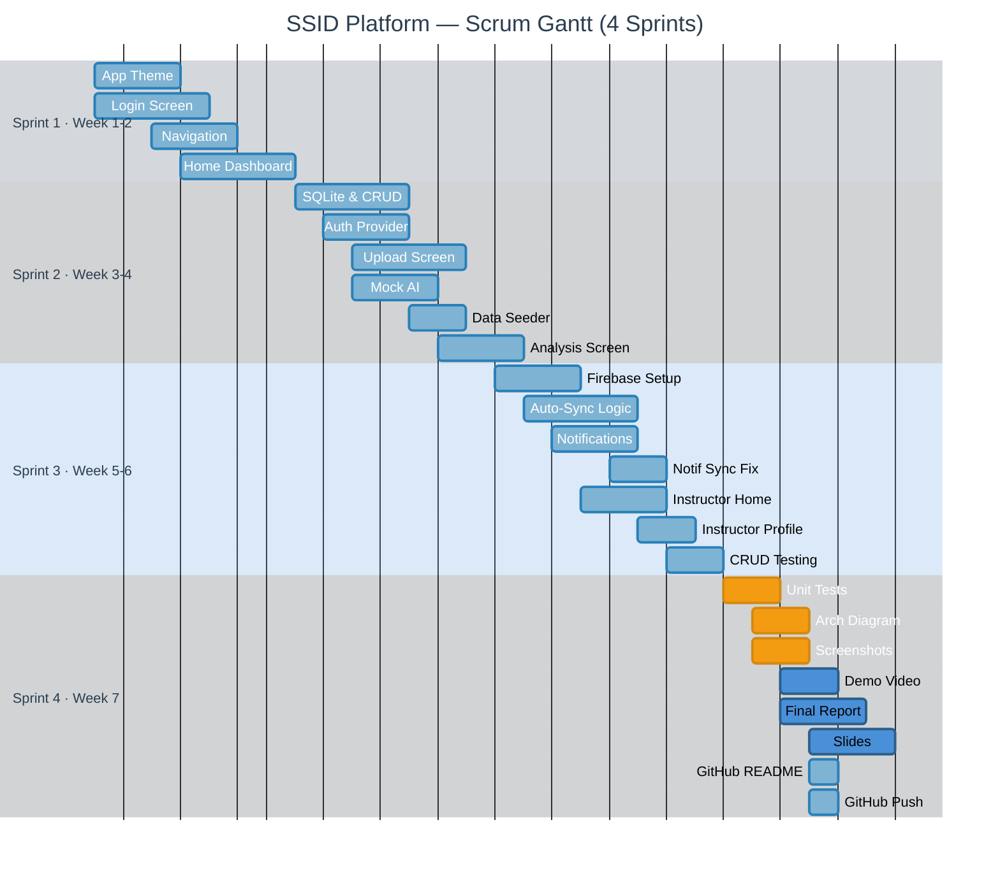

# 📅 Gantt Scrum Chart — SSID Platform (ssid_app_v2)

**Course:** Mobile Application Development  
**Team:** Aphinan (66112772) · Fasai (66126467) · Trirudee (66120361)

---

## 🗓️ Gantt Chart (Mermaid)



> **สี:** ⬜ กำลังจะทำ · 🟡 Active · ⬛ Done

---

## 📋 Task Reference Table

| # | Task | Owner | Sprint | Status |
|---|------|-------|--------|--------|
| 1 | App Theme Design | Fasai | 1 | ✅ Done |
| 2 | Login Screen | Fasai | 1 | ✅ Done |
| 3 | Navigation Setup | Fasai | 1 | ✅ Done |
| 4 | Home Dashboard UI | Fasai | 1 | ✅ Done |
| 5 | SQLite Schema & CRUD | Aphinan | 2 | ✅ Done |
| 6 | AuthProvider Integration | Aphinan | 2 | ✅ Done |
| 7 | Upload Screen UI | Fasai | 2 | ✅ Done |
| 8 | Mock AI Service | Trirudee | 2 | ✅ Done |
| 9 | Mock Data Seeder | Trirudee | 2 | ✅ Done |
| 10 | Analysis Result Screen | Fasai | 2 | ✅ Done |
| 11 | Firebase Firestore Setup | Aphinan | 3 | ✅ Done |
| 12 | Auto-Sync Logic | Aphinan | 3 | ✅ Done |
| 13 | Notification System | Aphinan+Fasai | 3 | ✅ Done |
| 14 | Notification Sync Fix | Aphinan | 3 | ✅ Done |
| 15 | Instructor Dashboard | Fasai | 3 | ✅ Done |
| 16 | Instructor Profile Screen | Fasai | 3 | ✅ Done |
| 17 | CRUD Sync Testing | Trirudee | 3 | ✅ Done |
| 18 | Unit Tests (Database) | Aphinan | 4 | ⬜ Todo |
| 19 | Architecture Diagram | Aphinan | 4 | ⬜ Todo |
| 20 | Screenshots All Screens | Fasai | 4 | ⬜ Todo |
| 21 | Demo Video (3-5 min) | Fasai | 4 | ⬜ Todo |
| 22 | Final Report (.md) | Trirudee | 4 | ⬜ Todo |
| 23 | Presentation Slides | Trirudee | 4 | ⬜ Todo |
| 24 | GitHub README.md | Trirudee | 4 | ✅ Done |
| 25 | GitHub Push | Aphinan | 4 | ✅ Done |

---

## 📈 Progress

```
Sprint 1  ████████████████████ 100% ✅
Sprint 2  ████████████████████ 100% ✅
Sprint 3  ████████████████████ 100% ✅
Sprint 4  ████████░░░░░░░░░░░░  40% 🔄
Total     ████████████████░░░░  80%
```

**17 / 25 tasks done**
