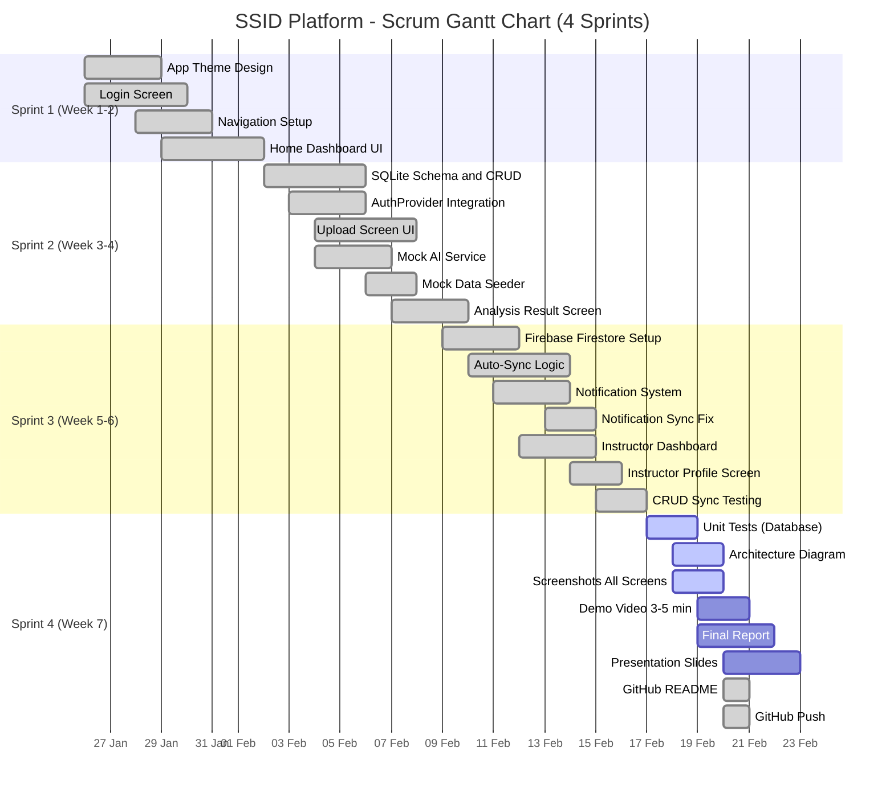

# 📅 Gantt Scrum Chart — SSID Platform (ssid_app_v2)

**Course:** Mobile Application Development  
**Team:** 66112772 Aphinan | 66126467 Fasai | 66120361 Trirudee  
**Duration:** 7 Weeks / 4 Sprints

---

## 🗓️ Gantt Chart



---

## 📊 Sprint Summary

| Sprint | Period | Main Focus | Status |
|--------|--------|-----------|--------|
| **Sprint 1** | Week 1-2 | UI Design, Login, Navigation | ✅ Done |
| **Sprint 2** | Week 3-4 | SQLite, Mock AI, Upload | ✅ Done |
| **Sprint 3** | Week 5-6 | Firebase Sync, Notifications, Testing | ✅ Done |
| **Sprint 4** | Week 7 | Report, Presentation, GitHub | 🔄 In Progress |

---

## 👥 Task Assignment by Member

### 🔵 66112772 Aphinan Ayuyong — Backend & Database

| Task | Sprint | Status |
|------|--------|--------|
| SQLite Schema (4 tables) | Sprint 2 | ✅ Done |
| DatabaseHelper (CRUD) | Sprint 2 | ✅ Done |
| Firebase Firestore Setup | Sprint 3 | ✅ Done |
| Auto-Sync Logic | Sprint 3 | ✅ Done |
| AuthProvider + SQLite Save | Sprint 2 | ✅ Done |
| Notification Sync Fix | Sprint 3 | ✅ Done |
| Unit Tests (Database) | Sprint 4 | ⬜ Todo |
| Architecture Diagram | Sprint 4 | ⬜ Todo |

### 🟢 66126467 Fasai Khwanpan — Frontend & UI/UX

| Task | Sprint | Status |
|------|--------|--------|
| App Theme Design | Sprint 1 | ✅ Done |
| Login Screen | Sprint 1 | ✅ Done |
| Home Dashboard (Student) | Sprint 1 | ✅ Done |
| Upload Screen | Sprint 2 | ✅ Done |
| Analysis Result Screen | Sprint 2 | ✅ Done |
| Notification Screen | Sprint 3 | ✅ Done |
| Instructor Dashboard | Sprint 3 | ✅ Done |
| Instructor Profile Screen | Sprint 3 | ✅ Done |
| Screenshots (All Screens) | Sprint 4 | ⬜ Todo |
| Demo Video (3-5 min) | Sprint 4 | ⬜ Todo |

### 🟡 66120361 Trirudee Kaeyiwa — QA, AI Mock & Documentation

| Task | Sprint | Status |
|------|--------|--------|
| Mock AI Service | Sprint 2 | ✅ Done |
| Mock Data Seeder | Sprint 2 | ✅ Done |
| CRUD Sync Testing | Sprint 3 | ✅ Done |
| Testing Guide (md) | Sprint 3 | ✅ Done |
| Final Report (.md) | Sprint 4 | ⬜ Todo |
| Presentation Slides | Sprint 4 | ⬜ Todo |
| GitHub README.md | Sprint 4 | ✅ Done |
| Scrum Report Summary | Sprint 4 | ✅ Done |

---

## 📈 Progress Overview

```
Sprint 1  [████████████████████] 100% ✅
Sprint 2  [████████████████████] 100% ✅
Sprint 3  [████████████████████] 100% ✅
Sprint 4  [████████░░░░░░░░░░░░]  40% 🔄
Overall   [████████████████░░░░]  80%
```

**Total Backlog:** 15 items | **Done:** 10 ✅ | **Remaining:** 5 ⬜
