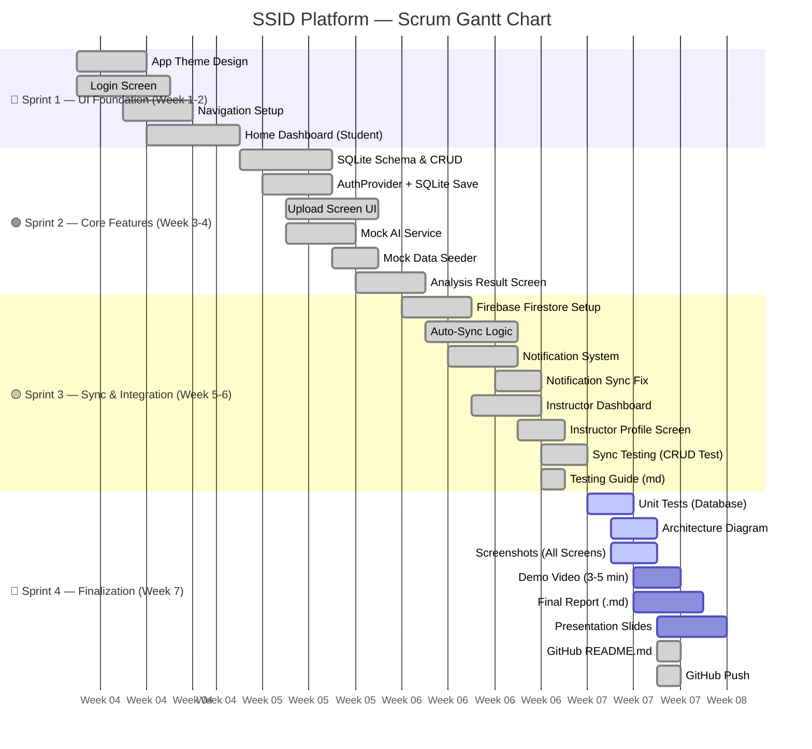

# 📅 Gantt Scrum Chart — SSID Platform (ssid_app_v2)

**วิชา:** Mobile Application Development  
**กลุ่ม:** 66112772 อภินันท์ | 66126467 ฟ้าใส | 66120361 ตรีฤทัย  
**ช่วงเวลา:** 7 สัปดาห์ (4 Sprints)

---

## 🗓️ Gantt Chart (Mermaid)



---

## 📊 Sprint Breakdown Table

| Sprint | ช่วงเวลา | งานหลัก | สถานะ |
|--------|----------|---------|-------|
| **Sprint 1** | สัปดาห์ 1–2 | UI Design, Login, Navigation | ✅ เสร็จสมบูรณ์ |
| **Sprint 2** | สัปดาห์ 3–4 | SQLite, Mock AI, Upload Feature | ✅ เสร็จสมบูรณ์ |
| **Sprint 3** | สัปดาห์ 5–6 | Firebase Sync, Notifications, Testing | ✅ เสร็จสมบูรณ์ |
| **Sprint 4** | สัปดาห์ 7 | Report, Presentation, GitHub | 🔄 กำลังดำเนินการ |

---

## 👥 Task Assignment by Member

### 🔵 66112772 นายอภินันท์ อายุยงค์ — Backend & Database

| Task | Sprint | Status |
|------|--------|--------|
| SQLite Schema (4 tables) | Sprint 2 | ✅ Done |
| DatabaseHelper (CRUD) | Sprint 2 | ✅ Done |
| Firebase Firestore Setup | Sprint 3 | ✅ Done |
| Auto-Sync Logic | Sprint 3 | ✅ Done |
| AuthProvider + SQLite Save | Sprint 2 | ✅ Done |
| Notification Sync Fix | Sprint 3 | ✅ Done |
| Unit Tests (Database) | Sprint 4 | ⬜ Todo |
| Architecture Diagram | Sprint 4 | ⬜ Todo |
| README Installation Guide | Sprint 4 | ✅ Done |

### 🟢 66126467 นางสาวฟ้าใส ขวัญปาน — Frontend & UI/UX

| Task | Sprint | Status |
|------|--------|--------|
| App Theme Design | Sprint 1 | ✅ Done |
| Login Screen | Sprint 1 | ✅ Done |
| Home Dashboard (Student) | Sprint 1 | ✅ Done |
| Upload Screen | Sprint 2 | ✅ Done |
| Analysis Result Screen | Sprint 2 | ✅ Done |
| Notification Screen | Sprint 3 | ✅ Done |
| Instructor Dashboard | Sprint 3 | ✅ Done |
| Instructor Profile Screen | Sprint 3 | ✅ Done |
| Screenshots (All Screens) | Sprint 4 | ⬜ Todo |
| Demo Video (3–5 min) | Sprint 4 | ⬜ Todo |

### 🟡 66120361 นางสาวตรีฤทัย แคยิหวา — QA, AI Mock & Documentation

| Task | Sprint | Status |
|------|--------|--------|
| Mock AI Service | Sprint 2 | ✅ Done |
| Mock Data Seeder | Sprint 2 | ✅ Done |
| Sync Testing (CRUD) | Sprint 3 | ✅ Done |
| Testing Guide (md) | Sprint 3 | ✅ Done |
| Final Report (.md) | Sprint 4 | ⬜ Todo |
| Presentation Slides | Sprint 4 | ⬜ Todo |
| GitHub README.md | Sprint 4 | ✅ Done |
| Scrum Report Summary | Sprint 4 | ✅ Done |

---

## 📈 Progress Overview

```
Sprint 1:  ████████████████████  100% ✅
Sprint 2:  ████████████████████  100% ✅
Sprint 3:  ████████████████████  100% ✅
Sprint 4:  ████████░░░░░░░░░░░░   40% 🔄
```

**Total Backlog:** 15 items  
**Completed:** 10 items ✅  
**In Progress / Todo:** 5 items ⬜
