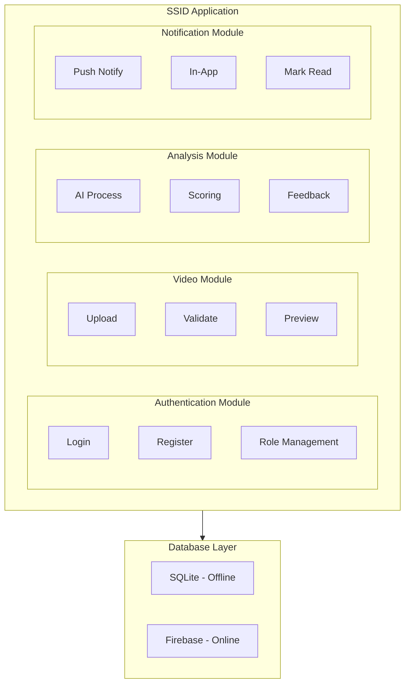
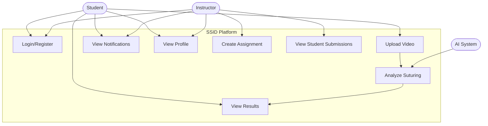
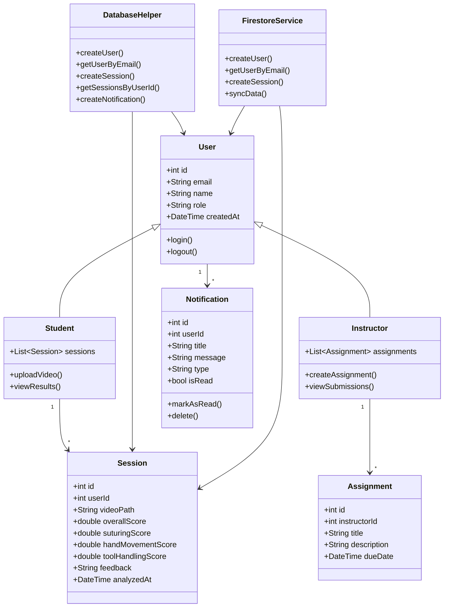
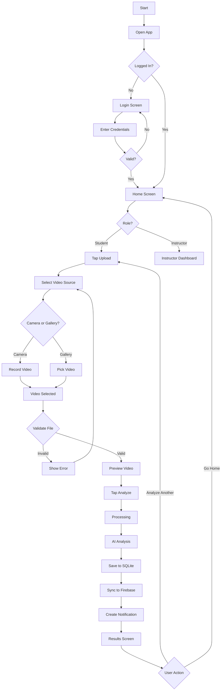
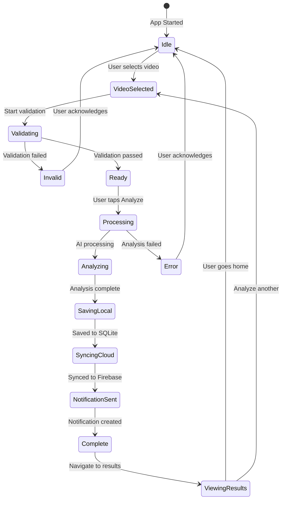
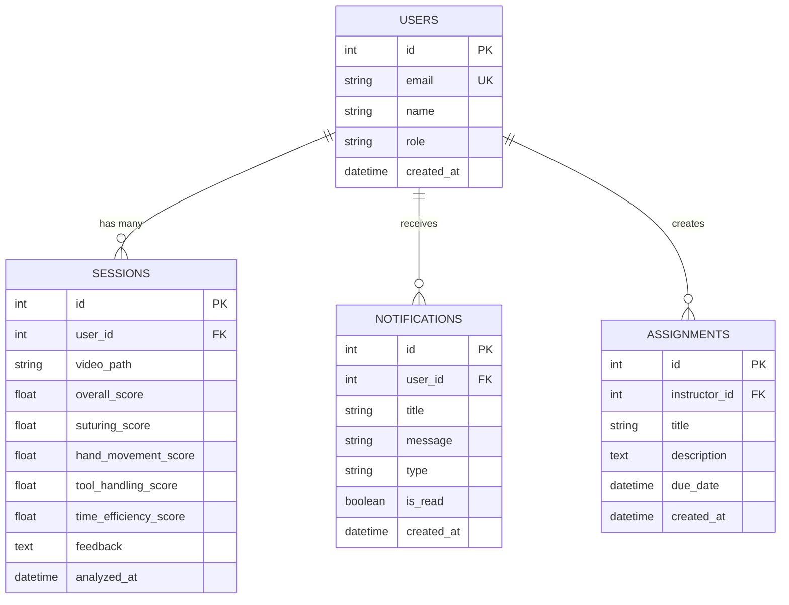

# รายงานโครงงาน SSID Application

## ระบบพัฒนาทักษะการเย็บแผลด้วยปัญญาประดิษฐ์

### Surgical Skill Improvement Dashboard (SSID)

---

**รายวิชา:** Mobile Application Development
**ภาคการศึกษา:** 2/2568
**วันที่ส่ง:** 15 กุมภาพันธ์ 2569

---

## สารบัญ

1. [บทนำและความต้องการของระบบ](#1-บทนำและความต้องการของระบบ)
2. [การวิเคราะห์ความต้องการเป็น Functional Requirements](#2-การวิเคราะห์ความต้องการเป็น-functional-requirements)
3. [การออกแบบระบบด้วย UML Diagrams](#3-การออกแบบระบบด้วย-uml-diagrams)
4. [การออกแบบหน้าจอ (Screen Design)](#4-การออกแบบหน้าจอ-screen-design)
5. [การออกแบบฐานข้อมูล (Database Design)](#5-การออกแบบฐานข้อมูล-database-design)
6. [การพัฒนา Prototype](#6-การพัฒนา-prototype)
7. [การเชื่อมต่อฐานข้อมูล](#7-การเชื่อมต่อฐานข้อมูล)
8. [สรุปผลการพัฒนา](#8-สรุปผลการพัฒนา)

---

## 1. บทนำและความต้องการของระบบ

### 1.1 ที่มาและความสำคัญ

การฝึกทักษะการเย็บแผลเป็นหนึ่งในทักษะพื้นฐานที่สำคัญสำหรับนักศึกษาแพทย์และบุคลากรทางการแพทย์ การประเมินทักษะดังกล่าวในปัจจุบันต้องอาศัยอาจารย์ผู้เชี่ยวชาญในการตรวจสอบ ซึ่งมีข้อจำกัดด้านเวลาและทรัพยากรบุคคล

แอปพลิเคชัน **SSID (Surgical Skill Improvement Dashboard)** ถูกพัฒนาขึ้นเพื่อช่วยเหลือในการฝึกฝนและประเมินทักษะการเย็บแผลโดยใช้เทคโนโลยี Artificial Intelligence (AI) ในการวิเคราะห์วิดีโอการฝึกปฏิบัติของนักศึกษา

### 1.2 ความต้องการของระบบ (System Requirements)

#### 1.2.1 Functional Requirements

| รหัส | ความต้องการ | รายละเอียด                                                                                                                        |
| -------- | ---------------------- | ------------------------------------------------------------------------------------------------------------------------------------------- |
| FR-01    | Authentication         | ระบบต้องรองรับการเข้าสู่ระบบด้วย Email และ Password พร้อมการเลือก Role (Student/Instructor) |
| FR-02    | Video Upload           | ผู้ใช้ (Student) สามารถอัปโหลดวิดีโอการฝึกปฏิบัติผ่าน Camera หรือ Gallery                     |
| FR-03    | AI Analysis            | ระบบสามารถวิเคราะห์วิดีโอด้วย AI และให้คะแนนพร้อม Feedback                                     |
| FR-04    | View Results           | ผู้ใช้สามารถดูผลการวิเคราะห์แบบละเอียด พร้อมกราฟแสดงคะแนนแต่ละด้าน         |
| FR-05    | Notifications          | ระบบสามารถแจ้งเตือนผู้ใช้เมื่อมีผลการวิเคราะห์หรืองานใหม่                          |
| FR-06    | Instructor Dashboard   | อาจารย์สามารถดู Dashboard รวมผลงานนักศึกษาทั้งหมด                                                     |
| FR-07    | Create Assignment      | อาจารย์สามารถสร้างงานมอบหมายให้นักศึกษา                                                              |
| FR-08    | Data Persistence       | ระบบต้องบันทึกข้อมูลทั้งแบบ Offline (SQLite) และ Online (Firebase)                                            |

#### 1.2.2 Non-Functional Requirements

| รหัส | ความต้องการ | รายละเอียด                                                                                                                 |
| -------- | ---------------------- | ------------------------------------------------------------------------------------------------------------------------------------ |
| NFR-01   | Performance            | ระบบต้องวิเคราะห์วิดีโอภายใน 5 วินาที                                                              |
| NFR-02   | Usability              | UI/UX ต้องใช้งานง่าย รองรับทั้ง Light และ Dark Theme                                                      |
| NFR-03   | Reliability            | ระบบต้องทำงานได้แม้ไม่มี Internet (Offline Mode)                                                             |
| NFR-04   | Security               | รหัสผ่านต้องมีความยาวอย่างน้อย 6 ตัวอักษร และมีทั้งตัวเลขและตัวอักษร |

#### 1.2.3 ผู้ใช้งานระบบ (Actors)

1. **Student (นักศึกษา)**

   - เข้าสู่ระบบ
   - อัปโหลดวิดีโอการฝึกปฏิบัติ
   - ดูผลการวิเคราะห์และ Feedback
   - ดูประวัติการฝึกฝน
   - รับการแจ้งเตือน
2. **Instructor (อาจารย์)**

   - เข้าสู่ระบบ
   - ดู Dashboard รวมผลงานนักศึกษา
   - สร้างงานมอบหมาย
   - ดูผลงานที่นักศึกษาส่ง
   - ให้ Feedback เพิ่มเติม

---

## 2. การวิเคราะห์ความต้องการเป็น Functional Requirements

### 2.1 การแบ่งโมดูลของระบบ

ระบบ SSID แบ่งออกเป็น 5 โมดูลหลัก:



### 2.2 ความสัมพันธ์กับเนื้อหารายวิชา

| หัวข้อรายวิชา | การนำไปใช้ในโครงงาน                                         |
| -------------------------- | ------------------------------------------------------------------------------ |
| Flutter Framework          | ใช้ Flutter ในการพัฒนา Cross-platform Mobile App                  |
| State Management           | ใช้ Provider Pattern สำหรับ AuthProvider และ NotificationProvider  |
| Navigation                 | ใช้ Named Routes สำหรับการนำทางระหว่างหน้าจอ     |
| Form Validation            | ใช้ Validators สำหรับตรวจสอบ Email, Password และ Video File |
| SQLite Database            | ใช้ sqflite package สำหรับ Local Database                             |
| Firebase                   | ใช้ Cloud Firestore สำหรับ Online Database                            |
| Camera/Gallery             | ใช้ image_picker package สำหรับเลือกวิดีโอ                 |

---

## 3. การออกแบบระบบด้วย UML Diagrams

### 3.1 Use Case Diagram



**คำอธิบาย Use Case Diagram:**

| Use Case                 | Actor               | คำอธิบาย                                                                |
| ------------------------ | ------------------- | ------------------------------------------------------------------------------- |
| Login/Register           | Student, Instructor | ผู้ใช้เข้าสู่ระบบด้วย Email/Password และเลือก Role |
| Upload Video             | Student             | นักศึกษาอัปโหลดวิดีโอการฝึกปฏิบัติ            |
| Analyze Suturing         | AI System           | ระบบ AI วิเคราะห์เทคนิคการเย็บแผล                  |
| View Results             | Student             | ดูผลการวิเคราะห์พร้อมกราฟและ Feedback               |
| View Notifications       | Student, Instructor | ดูการแจ้งเตือนต่างๆ                                          |
| Create Assignment        | Instructor          | อาจารย์สร้างงานมอบหมาย                                    |
| View Student Submissions | Instructor          | อาจารย์ดูผลงานที่นักศึกษาส่ง                        |

---

### 3.2 Class Diagram



**คำอธิบาย Class Diagram:**

| Class            | Responsibility                                                                                                |
| ---------------- | ------------------------------------------------------------------------------------------------------------- |
| User             | Base class สำหรับผู้ใช้งาน เก็บ email, name, role                                          |
| Student          | สืบทอดจาก User มีความสามารถอัปโหลดวิดีโอและดูผลวิเคราะห์    |
| Instructor       | สืบทอดจาก User มีความสามารถสร้างงานและดูผลงานนักศึกษา          |
| Session          | เก็บข้อมูลผลการวิเคราะห์แต่ละครั้ง รวมถึงคะแนนแต่ละด้าน |
| Notification     | เก็บข้อมูลการแจ้งเตือน พร้อมสถานะการอ่าน                               |
| Assignment       | เก็บข้อมูลงานที่มอบหมายโดยอาจารย์                                            |
| DatabaseHelper   | จัดการ SQLite database สำหรับ Offline Storage                                                     |
| FirestoreService | จัดการ Firebase Firestore สำหรับ Online Sync                                                      |

---

### 3.3 Activity Diagram - Video Analysis Flow



**คำอธิบาย Activity Diagram:**

กระบวนการวิเคราะห์วิดีโอแบ่งออกเป็นขั้นตอนหลักดังนี้:

1. **Authentication Phase:** ผู้ใช้เข้าสู่ระบบและระบบตรวจสอบสิทธิ์
2. **Role-Based Navigation:** ระบบนำทางไปยังหน้าที่เหมาะสมตาม Role
3. **Video Selection:** เลือกวิดีโอจาก Camera หรือ Gallery
4. **Validation Phase:** ตรวจสอบ File Type และ Size
5. **Analysis Phase:** AI ประมวลผลและวิเคราะห์วิดีโอ
6. **Storage Phase:** บันทึกลง SQLite และ Sync กับ Firebase
7. **Notification Phase:** สร้างการแจ้งเตือนและแสดงผลลัพธ์

---

### 3.4 Sequence Diagram - Login Process

```mermaid
sequenceDiagramS
    actor User
    participant Login as LoginScreen
    participant Val as Validators
    participant Auth as AuthProvider
    participant DB as DatabaseHelper
    participant FS as FirestoreService
    participant Home as HomeScreen

    User->>Login: Enter Email and Password
    Login->>Val: validateEmail(email)
    Val-->>Login: Valid
    Login->>Val: validatePassword(password)
    Val-->>Login: Valid
    User->>Login: Select Role and Tap Login
    Login->>Auth: login(email, name, role)
    Auth->>DB: getUserByEmail(email)
    DB-->>Auth: User data or null
    Auth->>DB: createUser(userData)
    DB-->>Auth: User ID
    Auth->>FS: syncUserData()
    FS-->>Auth: Sync complete
    Auth-->>Login: Login successful
    Login->>Home: Navigate based on role
    Home-->>User: Show Dashboard
```

---

### 3.5 State Diagram - Session States



**คำอธิบาย State Diagram:**

| State            | คำอธิบาย                                                     |
| ---------------- | -------------------------------------------------------------------- |
| Idle             | สถานะเริ่มต้น พร้อมรับ Input จากผู้ใช้ |
| VideoSelected    | เลือกวิดีโอแล้ว รอ Validation                       |
| Validating       | กำลังตรวจสอบ File Type และ Size                       |
| Invalid          | Validation ไม่ผ่าน ต้องเลือกไฟล์ใหม่         |
| Ready            | พร้อมส่งวิเคราะห์                                   |
| Processing       | กำลังประมวลผลวิดีโอ                               |
| Analyzing        | AI กำลังวิเคราะห์                                      |
| SavingLocal      | บันทึกลง SQLite                                              |
| SyncingCloud     | Sync ขึ้น Firebase                                               |
| NotificationSent | สร้างการแจ้งเตือนเสร็จสิ้น                 |
| Complete         | กระบวนการเสร็จสิ้น                                 |
| ViewingResults   | ผู้ใช้กำลังดูผลลัพธ์                             |

---

## 4. การออกแบบหน้าจอ (Screen Design)

### 4.1 รายการหน้าจอทั้งหมด

แอปพลิเคชัน SSID ประกอบด้วย **8 หน้าจอหลัก** ดังนี้:

| # | หน้าจอ       | ไฟล์                           | คำอธิบาย                                           |
| - | ------------------ | ---------------------------------- | ---------------------------------------------------------- |
| 1 | Splash Screen      | `splash_screen.dart`             | หน้าจอเริ่มต้นแสดง Logo และ Animation |
| 2 | Login Screen       | `login_screen.dart`              | หน้าจอเข้าสู่ระบบ                         |
| 3 | Student Home       | `home_screen.dart`               | หน้าหลักสำหรับนักศึกษา               |
| 4 | Instructor Home    | `instructor_home_screen.dart`    | หน้าหลักสำหรับอาจารย์                 |
| 5 | Upload Screen      | `upload_screen.dart`             | หน้าจออัปโหลดวิดีโอ                     |
| 6 | Analysis Results   | `analysis_result_screen.dart`    | หน้าจอแสดงผลวิเคราะห์                 |
| 7 | Notifications      | `notification_screen.dart`       | หน้าจอรายการแจ้งเตือน                 |
| 8 | Instructor Profile | `instructor_profile_screen.dart` | หน้าจอโปรไฟล์อาจารย์                   |

---

### 4.2 รายละเอียดแต่ละหน้าจอ

#### 4.2.1 Splash Screen

**ไฟล์:** `lib/screens/splash_screen.dart`

**วัตถุประสงค์:** แสดงหน้าจอเริ่มต้นพร้อม Logo และ Animation เป็นเวลา 3 วินาที ก่อนนำทางไปยังหน้า Login

**องค์ประกอบ:**

- Logo ของแอปพลิเคชัน
- Animation แบบ Fade-in
- ชื่อแอปพลิเคชัน "SSID"
- Gradient Background (สีน้ำเงิน-ม่วงอมชมพู)

**การทำงาน:**

1. แสดง Logo ด้วย Animation 3 วินาที
2. นำทางไปยัง Login Screen โดยอัตโนมัติ

---

#### 4.2.2 Login Screen

**ไฟล์:** `lib/screens/login_screen.dart`

**วัตถุประสงค์:** ให้ผู้ใช้เข้าสู่ระบบด้วย Email, Password และเลือก Role

**องค์ประกอบ:**

- Text Field สำหรับ Email
- Text Field สำหรับ Password (พร้อมปุ่มแสดง/ซ่อน)
- Text Field สำหรับ Name
- Dropdown สำหรับเลือก Role (Student/Instructor)
- ปุ่ม Login
- Error Messages สำหรับ Validation

**Data Validation:**

| Field    | กฎการตรวจสอบ                                                                                 |
| -------- | -------------------------------------------------------------------------------------------------------- |
| Email    | ต้องอยู่ในรูปแบบ Email ที่ถูกต้อง (regex:`^[\w-\.]+@([\w-]+\.)+[\w-]{2,4}$`) |
| Password | ต้องยาวอย่างน้อย 6 ตัวอักษร มีทั้งตัวเลขและตัวอักษร       |
| Name     | ต้องไม่เว้นว่าง                                                                           |
| Role     | ต้องเลือก Student หรือ Instructor                                                           |

**การทำงาน:**

1. ผู้ใช้กรอกข้อมูล
2. ระบบ Validate ข้อมูล
3. หากถูกต้อง → บันทึกลง Database → นำทางไปยัง Home Screen ตาม Role
4. หากไม่ถูกต้อง → แสดง Error Message

---

#### 4.2.3 Student Home Screen

**ไฟล์:** `lib/screens/home_screen.dart`

**วัตถุประสงค์:** หน้าหลักสำหรับนักศึกษา แสดง Dashboard และปุ่มอัปโหลดวิดีโอ

**องค์ประกอบ:**

- Header พร้อมชื่อผู้ใช้และ Avatar
- Notification Bell (แสดงจำนวน Unread)
- Stats Card (จำนวนการฝึก, คะแนนเฉลี่ย, ผ่าน/ไม่ผ่าน)
- ปุ่ม Upload Video
- Recent Analysis History (รายการวิเคราะห์ล่าสุด)
- Navigation ไปยังหน้าต่างๆ

**การทำงาน:**

1. โหลดข้อมูลผู้ใช้และ Session History จาก Database
2. แสดงสถิติการฝึกฝน
3. กดปุ่ม Upload → ไปหน้า Upload Screen
4. กดรายการ History → ดูผลวิเคราะห์เก่า
5. กด Notification Bell → ไปหน้า Notifications

---

#### 4.2.4 Instructor Home Screen

**ไฟล์:** `lib/screens/instructor_home_screen.dart`

**วัตถุประสงค์:** หน้าหลักสำหรับอาจารย์ แสดง Dashboard รวมผลงานนักศึกษา

**องค์ประกอบ:**

- Header พร้อมชื่ออาจารย์และ Avatar (Badge สีทอง)
- Notification Bell
- Dashboard Card (จำนวนนักศึกษา, งานที่มอบหมาย, งานที่ส่งแล้ว)
- Quick Actions (สร้างงาน, ดูสถิติ)
- Recent Submissions (งานที่นักศึกษาส่งล่าสุด)
- ปุ่ม Logout

**การทำงาน:**

1. โหลดข้อมูลสถิติจาก Database
2. แสดง Overview ของนักศึกษาทั้งหมด
3. กด "สร้างงาน" → แสดง Dialog สร้าง Assignment
4. กดรายการ Submission → ดูรายละเอียดผลงานนักศึกษา

---

#### 4.2.5 Upload Screen

**ไฟล์:** `lib/screens/upload_screen.dart`

**วัตถุประสงค์:** ให้นักศึกษาอัปโหลดวิดีโอการฝึกปฏิบัติ

**องค์ประกอบ:**

- ปุ่ม Record Video (ใช้ Camera)
- ปุ่ม Choose from Gallery
- Video Preview (หลังเลือกไฟล์)
- ปุ่ม Analyze Video
- Error Messages สำหรับ File Validation

**Data Validation:**

| รายการ | กฎการตรวจสอบ                      |
| ------------ | --------------------------------------------- |
| File Type    | รองรับเฉพาะ .mp4, .mov, .avi, .mkv |
| File Size    | ขนาดไม่เกิน 100MB                  |

**การทำงาน:**

1. เลือกวิดีโอจาก Camera หรือ Gallery
2. Validate File Type และ Size
3. แสดง Preview
4. กด Analyze → เรียก AI Service → บันทึกลง Database → ไปหน้า Results

---

#### 4.2.6 Analysis Results Screen

**ไฟล์:** `lib/screens/analysis_result_screen.dart`

**วัตถุประสงค์:** แสดงผลการวิเคราะห์วิดีโอโดย AI

**องค์ประกอบ:**

- Overall Score (คะแนนรวม)
- Skill Breakdown Chart (กราฟแท่งแสดงคะแนนแต่ละด้าน)
  - Suturing Technique
  - Hand Movement
  - Tool Handling
  - Time Efficiency
- Step-by-Step Analysis (รายละเอียดแต่ละขั้นตอน)
- AI Feedback (คำแนะนำจาก AI)
- ปุ่ม Back to Home

**การแสดงผล:**

- คะแนน ≥ 80%: แสดงสีเขียว (Excellent)
- คะแนน 60-79%: แสดงสีเหลือง (Good)
- คะแนน < 60%: แสดงสีแดง (Needs Improvement)

---

#### 4.2.7 Notification Screen

**ไฟล์:** `lib/screens/notification_screen.dart`

**วัตถุประสงค์:** แสดงรายการแจ้งเตือนทั้งหมด

**องค์ประกอบ:**

- รายการ Notification Cards
- ปุ่ม "Mark All as Read"
- Swipe to Delete
- Empty State (เมื่อไม่มีการแจ้งเตือน)

**ประเภทการแจ้งเตือน:**

| Type       | Icon      | สี           | ตัวอย่าง                               |
| ---------- | --------- | -------------- | ---------------------------------------------- |
| result     | Checkmark | เขียว     | ผลการวิเคราะห์พร้อมแล้ว |
| assignment | Clipboard | น้ำเงิน | มีงานใหม่จากอาจารย์         |
| alert      | Warning   | ส้ม         | เตือนความจำ                         |
| info       | Info      | เทา         | ข้อมูลทั่วไป                       |

**การทำงาน:**

1. โหลดรายการ Notification จาก Database
2. แสดงรายการ (Unread จะมีขอบสี)
3. กดรายการ → แสดง Detail Modal → Mark as Read
4. Swipe → Delete Notification

---

#### 4.2.8 Instructor Profile Screen

**ไฟล์:** `lib/screens/instructor_profile_screen.dart`

**วัตถุประสงค์:** แสดงโปรไฟล์และเมนูสำหรับอาจารย์

**องค์ประกอบ:**

- Profile Card (Avatar, ชื่อ, Email, Badge อาจารย์)
- Stats Grid (จำนวนนักศึกษา, งานที่ตรวจ, ชั่วโมงสอน, คะแนนประเมิน)
- Menu Items:
  - Settings
  - Manage Students
  - Reports
  - Help & Support
- ปุ่ม Logout

---

### 4.3 ความสัมพันธ์ของหน้าจอกับ Design

| หน้าจอ       | Use Case ที่เกี่ยวข้อง           | Class ที่ใช้งาน           |
| ------------------ | --------------------------------------------- | ---------------------------------- |
| Login Screen       | UC1: Login                                    | User, AuthProvider                 |
| Student Home       | UC4: View Results, UC5: Notifications         | Student, Session, Notification     |
| Instructor Home    | UC7: Create Assignment, UC8: View Submissions | Instructor, Assignment, Session    |
| Upload Screen      | UC2: Upload Video                             | Student, Session                   |
| Analysis Results   | UC3: Analyze, UC4: View Results               | Session, MockAIService             |
| Notifications      | UC5: View Notifications                       | Notification, NotificationProvider |
| Instructor Profile | UC6: View Profile                             | Instructor, User                   |

---

## 5. การออกแบบฐานข้อมูล (Database Design)

### 5.1 ER Diagram



---

### 5.2 โครงสร้างตาราง (Table Schema)

#### 5.2.1 ตาราง users

| Column     | Type    | Constraints                | คำอธิบาย                            |
| ---------- | ------- | -------------------------- | ------------------------------------------- |
| id         | INTEGER | PRIMARY KEY, AUTOINCREMENT | รหัสผู้ใช้                        |
| email      | TEXT    | NOT NULL, UNIQUE           | อีเมล (ใช้ Login)                   |
| name       | TEXT    | NOT NULL                   | ชื่อผู้ใช้                        |
| role       | TEXT    | NOT NULL                   | บทบาท: 'Student' หรือ 'Instructor' |
| created_at | TEXT    | DEFAULT CURRENT_TIMESTAMP  | วันที่สร้าง                      |

```sql
CREATE TABLE users (
    id INTEGER PRIMARY KEY AUTOINCREMENT,
    email TEXT NOT NULL UNIQUE,
    name TEXT NOT NULL,
    role TEXT NOT NULL,
    created_at TEXT DEFAULT CURRENT_TIMESTAMP
);
```

#### 5.2.2 ตาราง sessions

| Column                | Type    | Constraints                | คำอธิบาย                           |
| --------------------- | ------- | -------------------------- | ------------------------------------------ |
| id                    | INTEGER | PRIMARY KEY, AUTOINCREMENT | รหัส Session                           |
| user_id               | INTEGER | FOREIGN KEY → users(id)   | รหัสผู้ใช้                       |
| video_path            | TEXT    | NOT NULL                   | Path ของไฟล์วิดีโอ            |
| overall_score         | REAL    | NOT NULL                   | คะแนนรวม (0-100)                   |
| suturing_score        | REAL    |                            | คะแนนเทคนิคการเย็บ       |
| hand_movement_score   | REAL    |                            | คะแนนการเคลื่อนไหวมือ |
| tool_handling_score   | REAL    |                            | คะแนนการใช้เครื่องมือ |
| time_efficiency_score | REAL    |                            | คะแนนประสิทธิภาพเวลา   |
| feedback              | TEXT    |                            | Feedback จาก AI                         |
| analyzed_at           | TEXT    | DEFAULT CURRENT_TIMESTAMP  | วันเวลาที่วิเคราะห์     |

```sql
CREATE TABLE sessions (
    id INTEGER PRIMARY KEY AUTOINCREMENT,
    user_id INTEGER NOT NULL,
    video_path TEXT NOT NULL,
    overall_score REAL NOT NULL,
    suturing_score REAL,
    hand_movement_score REAL,
    tool_handling_score REAL,
    time_efficiency_score REAL,
    feedback TEXT,
    analyzed_at TEXT DEFAULT CURRENT_TIMESTAMP,
    FOREIGN KEY (user_id) REFERENCES users(id)
);
```

#### 5.2.3 ตาราง notifications

| Column     | Type    | Constraints                | คำอธิบาย                              |
| ---------- | ------- | -------------------------- | --------------------------------------------- |
| id         | INTEGER | PRIMARY KEY, AUTOINCREMENT | รหัสแจ้งเตือน                    |
| user_id    | INTEGER | FOREIGN KEY → users(id)   | รหัสผู้ใช้                          |
| title      | TEXT    | NOT NULL                   | หัวข้อแจ้งเตือน                |
| message    | TEXT    | NOT NULL                   | เนื้อหา                                |
| type       | TEXT    | NOT NULL                   | ประเภท: result, assignment, alert, info |
| is_read    | INTEGER | DEFAULT 0                  | สถานะการอ่าน                      |
| created_at | TEXT    | DEFAULT CURRENT_TIMESTAMP  | วันเวลาที่สร้าง                |

```sql
CREATE TABLE notifications (
    id INTEGER PRIMARY KEY AUTOINCREMENT,
    user_id INTEGER NOT NULL,
    title TEXT NOT NULL,
    message TEXT NOT NULL,
    type TEXT NOT NULL,
    is_read INTEGER DEFAULT 0,
    created_at TEXT DEFAULT CURRENT_TIMESTAMP,
    FOREIGN KEY (user_id) REFERENCES users(id)
);
```

#### 5.2.4 ตาราง assignments

| Column        | Type    | Constraints                | คำอธิบาย                       |
| ------------- | ------- | -------------------------- | -------------------------------------- |
| id            | INTEGER | PRIMARY KEY, AUTOINCREMENT | รหัสงาน                         |
| instructor_id | INTEGER | FOREIGN KEY → users(id)   | รหัสอาจารย์ผู้สร้าง |
| title         | TEXT    | NOT NULL                   | ชื่องาน                         |
| description   | TEXT    |                            | รายละเอียดงาน             |
| due_date      | TEXT    |                            | กำหนดส่ง                       |
| created_at    | TEXT    | DEFAULT CURRENT_TIMESTAMP  | วันที่สร้าง                 |

```sql
CREATE TABLE assignments (
    id INTEGER PRIMARY KEY AUTOINCREMENT,
    instructor_id INTEGER NOT NULL,
    title TEXT NOT NULL,
    description TEXT,
    due_date TEXT,
    created_at TEXT DEFAULT CURRENT_TIMESTAMP,
    FOREIGN KEY (instructor_id) REFERENCES users(id)
);
```

---

### 5.3 ความสัมพันธ์ของฐานข้อมูลกับหน้าจอ

| หน้าจอ                | ตาราง                         | CRUD Operations                                                                                |
| --------------------------- | ---------------------------------- | ---------------------------------------------------------------------------------------------- |
| **Login Screen**      | `users`                          | **C**reate (สร้างผู้ใช้ใหม่), **R**ead (ตรวจสอบผู้ใช้) |
| **Student Home**      | `sessions`                       | **R**ead (โหลด History)                                                              |
| **Instructor Home**   | `sessions`, `users`            | **R**ead (โหลดงานที่ส่ง, สถิติ)                                        |
| **Upload Screen**     | `sessions`, `notifications`    | **C**reate (บันทึกผลวิเคราะห์, สร้างแจ้งเตือน)            |
| **Analysis Results**  | `sessions`                       | **R**ead (แสดงผลที่บันทึกไว้)                                          |
| **Notifications**     | `notifications`                  | **R**ead, **U**pdate (Mark as Read), **D**elete                              |
| **Create Assignment** | `assignments`, `notifications` | **C**reate (สร้างงาน, แจ้งเตือนนักศึกษา)                        |

---

## 6. การพัฒนา Prototype

### 6.1 โครงสร้างโปรเจกต์

```text
ssid_app_v2/
├── lib/
│   ├── main.dart                   # Entry Point + Routes
│   ├── providers/
│   │   ├── auth_provider.dart      # Authentication State
│   │   └── notification_provider.dart
│   ├── screens/
│   │   ├── splash_screen.dart
│   │   ├── login_screen.dart
│   │   ├── home_screen.dart
│   │   ├── instructor_home_screen.dart
│   │   ├── instructor_profile_screen.dart
│   │   ├── upload_screen.dart
│   │   ├── analysis_result_screen.dart
│   │   └── notification_screen.dart
│   ├── services/
│   │   ├── database_helper.dart    # SQLite CRUD
│   │   ├── firestore_service.dart  # Firebase CRUD
│   │   └── mock_ai_service.dart    # AI Simulation
│   ├── theme/
│   │   ├── app_theme.dart
│   │   └── colors.dart
│   └── utils/
│       └── validators.dart         # Data Validation
├── docs/
│   ├── uml_diagrams.md
│   └── database_design.md
└── pubspec.yaml
```

---

### 6.2 การนำทางระหว่างหน้าจอ (Navigation)

```dart
// main.dart - Route Definitions
routes: {
  '/': (context) => const SplashScreen(),
  '/login': (context) => const LoginScreen(),
  '/home': (context) => const RoleBasedHomeScreen(),
  '/instructor-home': (context) => const InstructorHomeScreen(),
  '/instructor-profile': (context) => const InstructorProfileScreen(),
  '/upload': (context) => const UploadScreen(),
  '/analysis': (context) => const AnalysisResultScreen(),
  '/notifications': (context) => const NotificationScreen(),
}
```

**Navigation Flow:**

```
Splash Screen (3s)
       │
       ▼
  Login Screen
       │
       ├─── Role: Student ──────────▶ Student Home
       │                                    │
       │                                    ├── Upload Screen ──▶ Results
       │                                    ├── Notifications
       │                                    └── Profile
       │
       └─── Role: Instructor ───────▶ Instructor Home
                                            │
                                            ├── Create Assignment
                                            ├── View Submissions
                                            ├── Notifications
                                            └── Instructor Profile
```

---

### 6.3 การตรวจสอบข้อมูล (Data Validation)

**ไฟล์:** `lib/utils/validators.dart`

#### 6.3.1 Email Validation

```dart
static String? validateEmail(String? value) {
  if (value == null || value.isEmpty) {
    return 'Email is required';
  }
  
  final emailRegex = RegExp(r'^[\w-\.]+@([\w-]+\.)+[\w-]{2,4}$');
  if (!emailRegex.hasMatch(value)) {
    return 'Please enter a valid email address';
  }
  
  return null;
}
```

#### 6.3.2 Password Validation

```dart
static String? validatePassword(String? value) {
  if (value == null || value.isEmpty) {
    return 'Password is required';
  }
  
  if (value.length < 6) {
    return 'Password must be at least 6 characters';
  }
  
  if (!RegExp(r'[0-9]').hasMatch(value)) {
    return 'Password must contain at least one number';
  }
  
  if (!RegExp(r'[a-zA-Z]').hasMatch(value)) {
    return 'Password must contain at least one letter';
  }
  
  return null;
}
```

#### 6.3.3 Video File Validation

```dart
static String? validateVideoFile(String? filePath) {
  if (filePath == null || filePath.isEmpty) {
    return 'Please select a video file';
  }
  
  final validExtensions = ['.mp4', '.mov', '.avi', '.mkv'];
  final extension = filePath.toLowerCase().substring(filePath.lastIndexOf('.'));
  
  if (!validExtensions.contains(extension)) {
    return 'Invalid file format. Supported: MP4, MOV, AVI, MKV';
  }
  
  return null;
}

static String? validateFileSize(int? sizeInBytes, int maxSizeMB) {
  if (sizeInBytes == null) {
    return 'Unable to determine file size';
  }
  
  final maxSizeBytes = maxSizeMB * 1024 * 1024;
  if (sizeInBytes > maxSizeBytes) {
    return 'File size must be less than ${maxSizeMB}MB';
  }
  
  return null;
}
```

---

## 7. การเชื่อมต่อฐานข้อมูล

### 7.1 SQLite Database (Offline)

**ไฟล์:** `lib/services/database_helper.dart`

#### CRUD Operations สำหรับ Users

```dart
// CREATE - สร้างผู้ใช้ใหม่
Future<int> createUser(Map<String, dynamic> user) async {
  final db = await database;
  return await db.insert('users', user);
}

// READ - ค้นหาผู้ใช้จาก Email
Future<Map<String, dynamic>?> getUserByEmail(String email) async {
  final db = await database;
  final result = await db.query(
    'users',
    where: 'email = ?',
    whereArgs: [email],
  );
  return result.isNotEmpty ? result.first : null;
}

// UPDATE - แก้ไขข้อมูลผู้ใช้
Future<int> updateUser(int id, Map<String, dynamic> user) async {
  final db = await database;
  return await db.update('users', user, where: 'id = ?', whereArgs: [id]);
}

// DELETE - ลบผู้ใช้
Future<int> deleteUser(int id) async {
  final db = await database;
  return await db.delete('users', where: 'id = ?', whereArgs: [id]);
}
```

#### CRUD Operations สำหรับ Sessions

```dart
// CREATE - บันทึกผลวิเคราะห์ใหม่
Future<int> createSession(Map<String, dynamic> session) async {
  final db = await database;
  return await db.insert('sessions', session);
}

// READ - ดึงผลวิเคราะห์ของผู้ใช้
Future<List<Map<String, dynamic>>> getSessionsByUserId(int userId) async {
  final db = await database;
  return await db.query(
    'sessions',
    where: 'user_id = ?',
    whereArgs: [userId],
    orderBy: 'analyzed_at DESC',
  );
}

// UPDATE - แก้ไขผลวิเคราะห์
Future<int> updateSession(int id, Map<String, dynamic> session) async {
  final db = await database;
  return await db.update('sessions', session, where: 'id = ?', whereArgs: [id]);
}

// DELETE - ลบผลวิเคราะห์
Future<int> deleteSession(int id) async {
  final db = await database;
  return await db.delete('sessions', where: 'id = ?', whereArgs: [id]);
}
```

#### CRUD Operations สำหรับ Notifications

```dart
// CREATE
Future<int> createNotification(Map<String, dynamic> notification);

// READ
Future<List<Map<String, dynamic>>> getNotificationsByUserId(int userId);
Future<int> getUnreadNotificationCount(int userId);

// UPDATE
Future<int> markNotificationAsRead(int id);
Future<int> markAllNotificationsAsRead(int userId);

// DELETE
Future<int> deleteNotification(int id);
```

---

### 7.2 Firebase Firestore (Online)

**ไฟล์:** `lib/services/firestore_service.dart`

#### 7.2.1 CRUD Operations

```dart
// CREATE - สร้างผู้ใช้ใหม่ใน Firestore
Future<String> createUser({
  required String email,
  required String name,
  required String role,
}) async {
  final docRef = await usersCollection.add({
    'email': email,
    'name': name,
    'role': role,
    'createdAt': FieldValue.serverTimestamp(),
  });
  return docRef.id;
}

// READ - ดึงข้อมูลผู้ใช้ (Real-time Stream)
Stream<List<Map<String, dynamic>>> getAllUsers() {
  return usersCollection.snapshots().map((snapshot) {
    return snapshot.docs.map((doc) {
      return {'id': doc.id, ...doc.data() as Map<String, dynamic>};
    }).toList();
  });
}

// UPDATE - แก้ไขข้อมูล
Future<void> updateUser(String id, Map<String, dynamic> data) async {
  await usersCollection.doc(id).update(data);
}

// DELETE - ลบข้อมูล
Future<void> deleteUser(String id) async {
  await usersCollection.doc(id).delete();
}
```

---

### 7.3 การใช้งานในแอปพลิเคชัน

**ตัวอย่าง: บันทึกผลวิเคราะห์ใน Upload Screen**

```dart
// upload_screen.dart
Future<void> _analyzeVideo() async {
  // เรียก AI Service
  final result = await MockAIService.analyzeVideo(_selectedVideo!.path);
  
  // บันทึกลง SQLite
  final db = DatabaseHelper.instance;
  await db.createSession({
    'user_id': userId,
    'video_path': _selectedVideo!.path,
    'overall_score': result.overallScore,
    'suturing_score': result.suturingTechnique,
    'hand_movement_score': result.handMovement,
    'tool_handling_score': result.toolHandling,
    'time_efficiency_score': result.timeEfficiency,
    'feedback': result.feedback,
    'analyzed_at': DateTime.now().toIso8601String(),
  });
  
  // สร้าง Notification
  await db.createNotification({
    'user_id': userId,
    'title': 'ผลการวิเคราะห์พร้อมแล้ว',
    'message': 'คะแนนรวม: ${result.overallScore.toStringAsFixed(0)}%',
    'type': 'result',
    'is_read': 0,
  });
  
  // นำทางไปหน้าผลลัพธ์
  Navigator.pushNamed(context, '/analysis', arguments: result);
}
```

---

## 8. สรุปผลการพัฒนา

### 8.1 ตารางสรุปความครบถ้วนตามโจทย์

| หัวข้อ                                                    | คะแนนเต็ม | สถานะ        | คะแนนที่ได้ |
| --------------------------------------------------------------- | ------------------ | ----------------- | ---------------------- |
| **Design App + Database**                                 | **10**       |                   | **10**           |
| - อธิบายความต้องการ                            | 1                  | ✅                | 1                      |
| - วิเคราะห์ความต้องการเป็น Functions    | 1                  | ✅                | 1                      |
| - UML Diagrams (3+)                                             | 2                  | ✅ 5 diagrams     | 2                      |
| - ออกแบบหน้าจอ                                      | 2                  | ✅ 8 หน้าจอ | 2                      |
| - อธิบายความสัมพันธ์หน้าจอกับ Design | 1                  | ✅                | 1                      |
| - โครงสร้างฐานข้อมูล (2+ ตาราง)          | 2                  | ✅ 4 ตาราง   | 2                      |
| - อธิบายความสัมพันธ์ DB กับหน้าจอ    | 2                  | ✅                | 2                      |
| **Prototype**                                             | **5**        |                   | **5**            |
| - หน้าจอหลัก 70%+                                     | 2.5                | ✅ 100%           | 2.5                    |
| - หน้าจอเชื่อมต่อกัน                          | 1                  | ✅                | 1                      |
| - Data Validation 3+ หน้าจอ                               | 1.5                | ✅                | 1.5                    |
| **Database**                                              | **5**        |                   | **5**            |
| - SQLite CRUD                                                   | 2.5                | ✅                | 2.5                    |
| - Firebase CRUD                                                 | 2.5                | ✅                | 2.5                    |
| **รวม**                                                | **20**       |                   | **20**           |

---

### 8.2 เทคโนโลยีที่ใช้

| หมวด         | เทคโนโลยี | เวอร์ชัน |
| ---------------- | ------------------ | ---------------- |
| Framework        | Flutter            | 3.x              |
| Language         | Dart               | 3.x              |
| State Management | Provider           | 6.x              |
| Local Database   | sqflite            | Latest           |
| Cloud Database   | Cloud Firestore    | 5.6.x            |
| Authentication   | Firebase Auth      | 5.7.x            |
| Icons            | Lucide Icons       | Latest           |
| Fonts            | Google Fonts       | 7.x              |
| Camera/Gallery   | image_picker       | Latest           |

---

### 8.3 ไฟล์โปรเจกต์ที่สำคัญ

| ไฟล์                                | คำอธิบาย                     |
| --------------------------------------- | ------------------------------------ |
| `lib/main.dart`                       | Entry point และ Route definitions |
| `lib/services/database_helper.dart`   | SQLite CRUD operations               |
| `lib/services/firestore_service.dart` | Firebase CRUD operations             |
| `lib/utils/validators.dart`           | Data validation functions            |
| `docs/uml_diagrams.md`                | UML Diagrams (5 diagrams)            |
| `docs/database_design.md`             | ER Diagram และ Table Schema       |

---

### 8.4 Flutter Analyze Result

```
Analyzing ssid_app_v2...
No issues found! (ran in 6.6s)
```

✅ **Code Quality: ผ่านมาตรฐาน Flutter Analyzer ไม่พบ Issues ใดๆ**

---

## ภาคผนวก

### A. วิธีการติดตั้งและรันโปรเจกต์

```bash
# Clone repository
git clone [repository-url]

# เข้าไปยัง Directory
cd ssid_app_v2

# ติดตั้ง Dependencies
flutter pub get

# รันแอปพลิเคชัน
flutter run
```

### B. Dependencies (pubspec.yaml)

```yaml
dependencies:
  flutter:
    sdk: flutter
  provider: ^6.0.0
  sqflite: ^2.3.0
  path: ^1.8.3
  firebase_core: ^3.15.2
  cloud_firestore: ^5.6.12
  firebase_auth: ^5.7.0
  image_picker: ^1.0.4
  lucide_icons: ^0.257.0
  google_fonts: ^7.1.0
  intl: ^0.19.0
```

---

**จัดทำโดย:** [ชื่อนักศึกษา]
**รหัสนักศึกษา:** [รหัส]
**วันที่:** 1 กุมภาพันธ์ 2569
