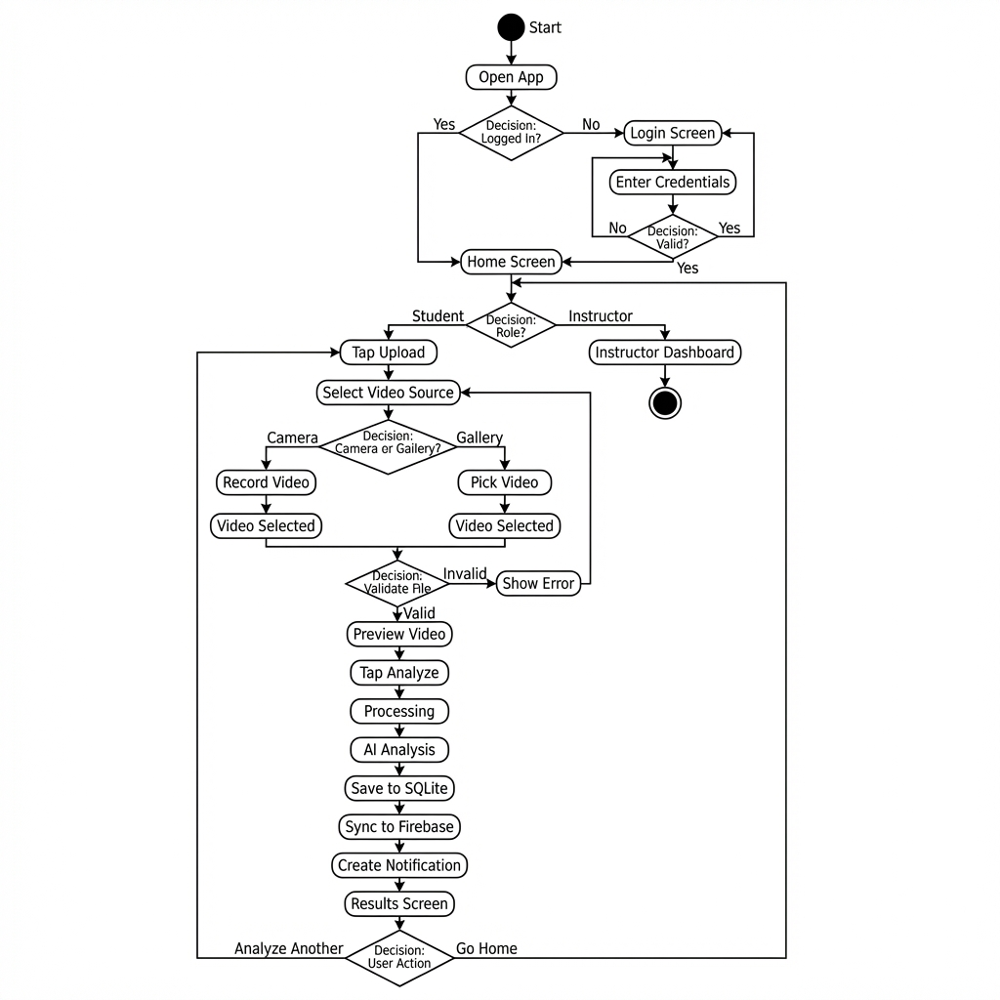

# รายงานการพัฒนา Prototype

## SSID Application (Suturing Skills Identification Device)

**ชื่อ-นามสกุล:** [กรอกชื่อ-นามสกุล]
**รหัสนักศึกษา:** [กรอกรหัสนักศึกษา]
**รายวิชา:** Mobile Application Development
**วันที่ส่ง:** 18 มกราคม 2569

---

## สรุปการให้คะแนน

| หัวข้อ                                    | คะแนนเต็ม | หลักฐาน                             |
| ----------------------------------------------- | ------------------ | ------------------------------------------ |
| หน้าจอการทำงานหลัก 70%        | 2.5                | มี 8 หน้าจอหลัก ครบถ้วน |
| หน้าจอเชื่อมต่อกันได้      | 1.0                | Navigation ทำงานครบทุกหน้า  |
| การตรวจสอบข้อมูล 3 หน้าจอ | 1.5                | Login, Register, Upload Screen             |
| **รวม**                                | **5.0**      |                                            |

---

## 1. หน้าจอการทำงานหลัก (8 Main Screens)

### 1.1 Login Screen (Student)

**ไฟล์:** `lib/screens/login_screen.dart`

**วัตถุประสงค์:** หน้าเข้าสู่ระบบสำหรับนักศึกษา

**องค์ประกอบ:**

- Text Field: Email
- Text Field: Password
- Dropdown: Role Selection (Student)
- ปุ่ม Login


---

### 1.2 Login Screen (Instructor)

**ไฟล์:** `lib/screens/login_screen.dart`

**วัตถุประสงค์:** หน้าเข้าสู่ระบบสำหรับอาจารย์

**องค์ประกอบ:**

- Text Field: Email
- Text Field: Password
- Dropdown: Role Selection (Instructor)
- ปุ่ม Login


---

### 1.3 Home Screen (Student)

**ไฟล์:** `lib/screens/home_screen.dart`

**วัตถุประสงค์:** หน้าหลักสำหรับนักศึกษา

**องค์ประกอบ:**

- Welcome Message พร้อมชื่อผู้ใช้
- Recent Sessions List
- Statistics Dashboard (จำนวน Sessions, คะแนนเฉลี่ย)
- Bottom Navigation Bar


---

### 1.4 Home Screen (Instructor)

**ไฟล์:** `lib/screens/instructor_home_screen.dart`

**วัตถุประสงค์:** หน้าหลักสำหรับอาจารย์

**องค์ประกอบ:**

- Dashboard แสดงสถิติของนักศึกษา
- จำนวน Submissions
- Activity Log
- Create Assignment Button


---

### 1.5 Upload Screen

**ไฟล์:** `lib/screens/upload_screen.dart`

**วัตถุประสงค์:** หน้าอัปโหลดวิดีโอเพื่อวิเคราะห์

**องค์ประกอบ:**

- ปุ่มเลือกจาก Camera
- ปุ่มเลือกจาก Gallery
- Video Preview Area
- ปุ่ม Analyze


---

### 1.6 Video Selected Screen

**ไฟล์:** `lib/screens/upload_screen.dart`

**วัตถุประสงค์:** แสดง Preview วิดีโอที่เลือก

**องค์ประกอบ:**

- Video Thumbnail Preview
- Video Information (ชื่อไฟล์)
- ปุ่ม Analyze
- ปุ่มเปลี่ยนวิดีโอ


---

### 1.7 Analysis Result Screen

**ไฟล์:** `lib/screens/analysis_result_screen.dart`

**วัตถุประสงค์:** แสดงผลการวิเคราะห์วิดีโอ

**องค์ประกอบ:**

- Overall Score (แสดงเป็น Circular Progress)
- Detailed Scores:
  - Suturing Technique Score
  - Hand Movement Score
  - Tool Handling Score
  - Time Efficiency Score
- Feedback Text


---

### 1.8 Notification Screen

**ไฟล์:** `lib/screens/notification_screen.dart`

**วัตถุประสงค์:** แสดงรายการแจ้งเตือน

**องค์ประกอบ:**

- Notification List
- Mark as Read Button
- Swipe to Delete
- Empty State


---

### 1.9 Profile Screen (Instructor)

**ไฟล์:** `lib/screens/instructor_profile_screen.dart`

**วัตถุประสงค์:** แสดงข้อมูลผู้ใช้

**องค์ประกอบ:**

- Profile Avatar
- ข้อมูลผู้ใช้ (ชื่อ, อีเมล, Role)
- Statistics Summary
- Logout Button


---

## 2. การเชื่อมต่อหน้าจอ (Navigation)

### 2.1 Navigation Flow



### 2.2 Route Configuration

```dart
// main.dart - Route Configuration
MaterialApp(
  initialRoute: '/splash',
  routes: {
    '/splash': (context) => const SplashScreen(),
    '/login': (context) => const LoginScreen(),
    '/home': (context) => const HomeScreen(),
    '/instructor-home': (context) => const InstructorHomeScreen(),
    '/upload': (context) => const UploadScreen(),
    '/notifications': (context) => const NotificationScreen(),
    '/instructor-profile': (context) => const InstructorProfileScreen(),
  },
  onGenerateRoute: (settings) {
    if (settings.name == '/analysis-result') {
      final session = settings.arguments as Session;
      return MaterialPageRoute(
        builder: (context) => AnalysisResultScreen(session: session),
      );
    }
    return null;
  },
);
```

### 2.3 Navigation Methods

```dart
// Navigate to Home (Role-based)
void _navigateToHome(BuildContext context, String role) {
  if (role == 'instructor') {
    Navigator.pushReplacementNamed(context, '/instructor-home');
  } else {
    Navigator.pushReplacementNamed(context, '/home');
  }
}

// Navigate to Analysis Result
Navigator.pushNamed(
  context,
  '/analysis-result',
  arguments: session,
);

// Logout and Navigate to Login
Navigator.pushNamedAndRemoveUntil(
  context,
  '/login',
  (route) => false,
);
```

---

## 3. การตรวจสอบข้อมูล (Data Validation) - 3 หน้าจอ

### 3.1 Login Screen Validation

**ไฟล์:** `lib/utils/validators.dart`

| Field    | Validation Rules                                                                    |
| -------- | ----------------------------------------------------------------------------------- |
| Email    | ไม่ว่าง, รูปแบบ email ถูกต้อง                                   |
| Password | ไม่ว่าง, อย่างน้อย 6 ตัว, มีตัวเลข, มีตัวอักษร |
| Role     | ต้องเลือก Student หรือ Instructor                                      |

```dart
// Email Validation
static String? validateEmail(String? value) {
  if (value == null || value.isEmpty) {
    return 'กรุณากรอกอีเมล';
  }
  final emailRegex = RegExp(r'^[\w-\.]+@([\w-]+\.)+[\w-]{2,4}$');
  if (!emailRegex.hasMatch(value)) {
    return 'รูปแบบอีเมลไม่ถูกต้อง';
  }
  return null;
}

// Password Validation
static String? validatePassword(String? value) {
  if (value == null || value.isEmpty) {
    return 'กรุณากรอกรหัสผ่าน';
  }
  if (value.length < 6) {
    return 'รหัสผ่านต้องมีอย่างน้อย 6 ตัวอักษร';
  }
  if (!value.contains(RegExp(r'[0-9]'))) {
    return 'รหัสผ่านต้องมีตัวเลขอย่างน้อย 1 ตัว';
  }
  if (!value.contains(RegExp(r'[a-zA-Z]'))) {
    return 'รหัสผ่านต้องมีตัวอักษรอย่างน้อย 1 ตัว';
  }
  return null;
}
```

### 3.2 Register Screen Validation

| Field            | Validation Rules                                                                    |
| ---------------- | ----------------------------------------------------------------------------------- |
| Name             | ไม่ว่าง, อย่างน้อย 2 ตัวอักษร                               |
| Email            | ไม่ว่าง, รูปแบบ email ถูกต้อง, ไม่ซ้ำในระบบ         |
| Password         | ไม่ว่าง, อย่างน้อย 6 ตัว, มีตัวเลข, มีตัวอักษร |
| Confirm Password | ตรงกับ Password                                                               |

### 3.3 Upload Screen Validation

| Field      | Validation Rules                                           |
| ---------- | ---------------------------------------------------------- |
| Video File | ต้องเลือกไฟล์, นามสกุล MP4/MOV/AVI/MKV |
| File Size  | ไม่เกิน 100MB                                       |

```dart
// File Type Validation
void _validateVideoFile(XFile file) {
  final extension = file.path.split('.').last.toLowerCase();
  final allowedExtensions = ['mp4', 'mov', 'avi', 'mkv'];
  
  if (!allowedExtensions.contains(extension)) {
    throw Exception('รองรับเฉพาะไฟล์ MP4, MOV, AVI, MKV');
  }
}

// Video Selection Validation
void _validateVideoSelected() {
  if (_selectedVideo == null) {
    ScaffoldMessenger.of(context).showSnackBar(
      SnackBar(content: Text('กรุณาเลือกวิดีโอก่อน')),
    );
    return;
  }
}
```

---

## 4. โครงสร้างโปรเจกต์

```text
ssid_app_v2/
├── lib/
│   ├── main.dart               # Entry Point + Routes
│   ├── providers/
│   │   ├── auth_provider.dart  # Authentication State
│   │   └── notification_provider.dart
│   ├── screens/
│   │   ├── splash_screen.dart
│   │   ├── login_screen.dart
│   │   ├── home_screen.dart
│   │   ├── instructor_home_screen.dart
│   │   ├── upload_screen.dart
│   │   ├── analysis_result_screen.dart
│   │   ├── notification_screen.dart
│   │   └── instructor_profile_screen.dart
│   └── utils/
│       └── validators.dart     # Validation Functions
└── pubspec.yaml
```

---

## 5. เทคโนโลยีที่ใช้

| Technology   | Version  | Purpose              |
| ------------ | -------- | -------------------- |
| Flutter      | 3.24.5   | UI Framework         |
| Dart         | 3.5.4    | Programming Language |
| Provider     | ^6.1.2   | State Management     |
| google_fonts | ^6.2.1   | Typography           |
| lucide_icons | ^0.257.0 | Icons                |
| image_picker | ^1.1.2   | Video Selection      |

---

## 6. วิธีการติดตั้งและรันโปรเจกต์

```bash
# Clone หรือ Download โปรเจกต์
cd ssid_app_v2

# ติดตั้ง Dependencies
flutter pub get

# รันแอป
flutter run
```

---

**หมายเหตุ:** รายงานนี้จัดทำเพื่อส่งงาน Prototype (Screen Implementation - 5 Main Screens)
