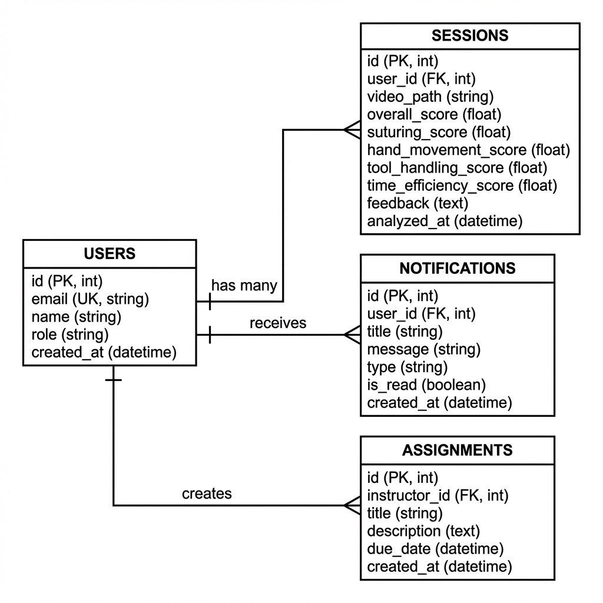

# รายงานการเชื่อมต่อฐานข้อมูล

## SSID Application (Suturing Skills Identification Device)

**ชื่อ-นามสกุล:** [กรอกชื่อ-นามสกุล]  
**รหัสนักศึกษา:** [กรอกรหัสนักศึกษา]  
**รายวิชา:** Mobile Application Development  
**วันที่ส่ง:** 1 กุมภาพันธ์ 2569

---

## สรุปการให้คะแนน

| หัวข้อ | คะแนนเต็ม | หลักฐาน |
|--------|-----------|---------|
| เชื่อมต่อ SQLite + CRUD | 2.5 | DatabaseHelper class |
| เชื่อมต่อ Online Database + CRUD | 2.5 | FirestoreService class |
| **รวม** | **5.0** | |

---

## หลักฐานการเชื่อมต่อฐานข้อมูล

### SQLite Database (Local)

**ภาพแสดงข้อมูลใน SQLite:**

| ตาราง | ภาพหลักฐาน |
|-------|-----------|
| users | [แทรกรูป SQLite users] |
| sessions | [แทรกรูป SQLite sessions] |
| notifications | [แทรกรูป SQLite notifications] |

> วิธีดูข้อมูล SQLite: ใช้ Android Studio → View → Tool Windows → App Inspection → Database Inspector

---

### Firebase Firestore (Online)

**ภาพแสดงข้อมูลใน Firebase Console:**

| Collection | ภาพหลักฐาน |
|------------|-----------|
| users | [แทรกรูป Firebase users] |
| sessions | [แทรกรูป Firebase sessions] |
| notifications | [แทรกรูป Firebase notifications] |
| assignments | [แทรกรูป Firebase assignments] |

> วิธีดูข้อมูล Firebase: เปิด <https://console.firebase.google.com/> → เลือก Project → Firestore Database

## 1. โครงสร้างฐานข้อมูล (Database Design)

### 1.1 ER Diagram



### 1.2 สรุปข้อมูลที่เชื่อมต่อกับแต่ละฐานข้อมูล

| ข้อมูล | SQLite (Offline) | Firebase Firestore (Online) | วัตถุประสงค์ |
|--------|-----------------|---------------------------|-------------|
| **Users** | ✓ | ✓ | เก็บข้อมูลผู้ใช้ (email, name, role) |
| **Sessions** | ✓ | ✓ | เก็บผลวิเคราะห์วิดีโอ (คะแนน, feedback) |
| **Notifications** | ✓ | ✓ | เก็บการแจ้งเตือน (title, message, type) |
| **Assignments** | ✓ | ✓ | เก็บงานที่อาจารย์สร้าง (title, description, due_date) |

### 1.3 หลักการทำงาน Hybrid Database

```
┌─────────────────────────────────────────────────────────────┐
│                      SSID Application                        │
├─────────────────────────────────────────────────────────────┤
│                                                              │
│   ผู้ใช้ทำ Action (Login, Upload, Create Assignment)          │
│                          │                                   │
│                          ▼                                   │
│   ┌──────────────────────────────────────────────┐          │
│   │         1. บันทึกลง SQLite (Local)            │          │
│   │         - ทำงานได้ทันที                        │          │
│   │         - ไม่ต้องใช้อินเทอร์เน็ต                 │          │
│   └──────────────────────────────────────────────┘          │
│                          │                                   │
│                          ▼                                   │
│   ┌──────────────────────────────────────────────┐          │
│   │      2. Sync ไป Firebase Firestore (Cloud)    │          │
│   │         - Backup ข้อมูล                        │          │
│   │         - แชร์ข้ามอุปกรณ์                       │          │
│   │         - Real-time updates                   │          │
│   └──────────────────────────────────────────────┘          │
│                                                              │
└─────────────────────────────────────────────────────────────┘
```

### 1.2 ตารางข้อมูล

#### USERS Table

| Column | Type | Constraint | Description |
|--------|------|------------|-------------|
| id | INTEGER | PRIMARY KEY | รหัสผู้ใช้ |
| email | TEXT | UNIQUE, NOT NULL | อีเมล |
| name | TEXT | NOT NULL | ชื่อผู้ใช้ |
| role | TEXT | NOT NULL | บทบาท (student/instructor) |
| created_at | TEXT | | วันที่สร้าง |

#### SESSIONS Table

| Column | Type | Constraint | Description |
|--------|------|------------|-------------|
| id | INTEGER | PRIMARY KEY | รหัส Session |
| user_id | INTEGER | FOREIGN KEY | รหัสผู้ใช้ |
| video_path | TEXT | | ที่อยู่ไฟล์วิดีโอ |
| overall_score | REAL | | คะแนนรวม |
| suturing_score | REAL | | คะแนนการเย็บแผล |
| hand_movement_score | REAL | | คะแนนการเคลื่อนไหวมือ |
| tool_handling_score | REAL | | คะแนนการใช้เครื่องมือ |
| time_efficiency_score | REAL | | คะแนนประสิทธิภาพเวลา |
| feedback | TEXT | | ข้อเสนอแนะ |
| analyzed_at | TEXT | | วันที่วิเคราะห์ |

#### NOTIFICATIONS Table

| Column | Type | Constraint | Description |
|--------|------|------------|-------------|
| id | INTEGER | PRIMARY KEY | รหัสแจ้งเตือน |
| user_id | INTEGER | FOREIGN KEY | รหัสผู้ใช้ |
| title | TEXT | | หัวข้อ |
| message | TEXT | | ข้อความ |
| type | TEXT | | ประเภท |
| is_read | INTEGER | | สถานะอ่าน |
| created_at | TEXT | | วันที่สร้าง |

#### ASSIGNMENTS Table

| Column | Type | Constraint | Description |
|--------|------|------------|-------------|
| id | INTEGER | PRIMARY KEY | รหัสงาน |
| instructor_id | INTEGER | FOREIGN KEY | รหัสอาจารย์ |
| title | TEXT | | หัวข้องาน |
| description | TEXT | | รายละเอียด |
| due_date | TEXT | | กำหนดส่ง |
| created_at | TEXT | | วันที่สร้าง |

---

## 2. SQLite Database (Offline)

**ไฟล์:** `lib/services/database_helper.dart`

### 2.1 การเชื่อมต่อฐานข้อมูล

```dart
import 'package:sqflite/sqflite.dart';
import 'package:path/path.dart';

class DatabaseHelper {
  static final DatabaseHelper instance = DatabaseHelper._init();
  static Database? _database;

  DatabaseHelper._init();

  // เชื่อมต่อฐานข้อมูล
  Future<Database> get database async {
    if (_database != null) return _database!;
    _database = await _initDB('ssid_database.db');
    return _database!;
  }

  Future<Database> _initDB(String fileName) async {
    final dbPath = await getDatabasesPath();
    final path = join(dbPath, fileName);

    return await openDatabase(
      path,
      version: 1,
      onCreate: _createDB,
    );
  }

  Future<void> _createDB(Database db, int version) async {
    // สร้างตาราง users
    await db.execute('''
      CREATE TABLE users(
        id INTEGER PRIMARY KEY AUTOINCREMENT,
        email TEXT UNIQUE NOT NULL,
        name TEXT NOT NULL,
        role TEXT NOT NULL,
        created_at TEXT
      )
    ''');

    // สร้างตาราง sessions
    await db.execute('''
      CREATE TABLE sessions(
        id INTEGER PRIMARY KEY AUTOINCREMENT,
        user_id INTEGER,
        video_path TEXT,
        overall_score REAL,
        suturing_score REAL,
        hand_movement_score REAL,
        tool_handling_score REAL,
        time_efficiency_score REAL,
        feedback TEXT,
        analyzed_at TEXT,
        FOREIGN KEY (user_id) REFERENCES users (id)
      )
    ''');

    // สร้างตาราง notifications
    await db.execute('''
      CREATE TABLE notifications(
        id INTEGER PRIMARY KEY AUTOINCREMENT,
        user_id INTEGER,
        title TEXT,
        message TEXT,
        type TEXT,
        is_read INTEGER DEFAULT 0,
        created_at TEXT,
        FOREIGN KEY (user_id) REFERENCES users (id)
      )
    ''');

    // สร้างตาราง assignments
    await db.execute('''
      CREATE TABLE assignments(
        id INTEGER PRIMARY KEY AUTOINCREMENT,
        instructor_id INTEGER,
        title TEXT,
        description TEXT,
        due_date TEXT,
        created_at TEXT,
        FOREIGN KEY (instructor_id) REFERENCES users (id)
      )
    ''');
  }
}
```

### 2.2 CRUD Operations - SQLite

#### CREATE (สร้างข้อมูล)

```dart
// สร้างผู้ใช้ใหม่
Future<int> createUser(Map<String, dynamic> userData) async {
  final db = await database;
  return await db.insert('users', {
    ...userData,
    'created_at': DateTime.now().toIso8601String(),
  });
}

// สร้าง Session ใหม่
Future<int> createSession(Map<String, dynamic> sessionData) async {
  final db = await database;
  return await db.insert('sessions', sessionData);
}

// สร้าง Notification ใหม่
Future<int> createNotification(Map<String, dynamic> notificationData) async {
  final db = await database;
  return await db.insert('notifications', {
    ...notificationData,
    'created_at': DateTime.now().toIso8601String(),
  });
}

// สร้าง Assignment ใหม่
Future<int> createAssignment(Map<String, dynamic> assignmentData) async {
  final db = await database;
  return await db.insert('assignments', {
    ...assignmentData,
    'created_at': DateTime.now().toIso8601String(),
  });
}
```

#### READ (อ่านข้อมูล)

```dart
// ดึงผู้ใช้ตาม Email
Future<Map<String, dynamic>?> getUserByEmail(String email) async {
  final db = await database;
  final result = await db.query(
    'users',
    where: 'email = ?',
    whereArgs: [email],
  );
  return result.isNotEmpty ? result.first : null;
}

// ดึง Sessions ทั้งหมดของผู้ใช้
Future<List<Map<String, dynamic>>> getSessionsByUserId(int userId) async {
  final db = await database;
  return await db.query(
    'sessions',
    where: 'user_id = ?',
    whereArgs: [userId],
    orderBy: 'analyzed_at DESC',
  );
}

// ดึง Notifications ของผู้ใช้
Future<List<Map<String, dynamic>>> getNotificationsByUserId(int userId) async {
  final db = await database;
  return await db.query(
    'notifications',
    where: 'user_id = ?',
    whereArgs: [userId],
    orderBy: 'created_at DESC',
  );
}

// ดึง Assignments ทั้งหมด
Future<List<Map<String, dynamic>>> getAllAssignments() async {
  final db = await database;
  return await db.query(
    'assignments',
    orderBy: 'due_date ASC',
  );
}
```

#### UPDATE (แก้ไขข้อมูล)

```dart
// อัพเดทข้อมูลผู้ใช้
Future<int> updateUser(int id, Map<String, dynamic> userData) async {
  final db = await database;
  return await db.update(
    'users',
    userData,
    where: 'id = ?',
    whereArgs: [id],
  );
}

// อัพเดท Session
Future<int> updateSession(int id, Map<String, dynamic> sessionData) async {
  final db = await database;
  return await db.update(
    'sessions',
    sessionData,
    where: 'id = ?',
    whereArgs: [id],
  );
}

// Mark Notification as Read
Future<int> markNotificationAsRead(int id) async {
  final db = await database;
  return await db.update(
    'notifications',
    {'is_read': 1},
    where: 'id = ?',
    whereArgs: [id],
  );
}
```

#### DELETE (ลบข้อมูล)

```dart
// ลบผู้ใช้
Future<int> deleteUser(int id) async {
  final db = await database;
  return await db.delete(
    'users',
    where: 'id = ?',
    whereArgs: [id],
  );
}

// ลบ Session
Future<int> deleteSession(int id) async {
  final db = await database;
  return await db.delete(
    'sessions',
    where: 'id = ?',
    whereArgs: [id],
  );
}

// ลบ Notification
Future<int> deleteNotification(int id) async {
  final db = await database;
  return await db.delete(
    'notifications',
    where: 'id = ?',
    whereArgs: [id],
  );
}
```

---

## 3. Firebase Firestore (Online Database)

**ไฟล์:** `lib/services/firestore_service.dart`

### 3.1 การเชื่อมต่อ Firebase

```dart
import 'package:cloud_firestore/cloud_firestore.dart';
import 'package:firebase_core/firebase_core.dart';

class FirestoreService {
  final FirebaseFirestore _firestore = FirebaseFirestore.instance;

  // Collections
  CollectionReference get usersCollection => _firestore.collection('users');
  CollectionReference get sessionsCollection => _firestore.collection('sessions');
  CollectionReference get notificationsCollection => _firestore.collection('notifications');
  CollectionReference get assignmentsCollection => _firestore.collection('assignments');
}
```

### 3.2 CRUD Operations - Firestore

#### CREATE (สร้างข้อมูล)

```dart
// สร้างผู้ใช้ใหม่ใน Firestore
Future<String> createUser({
  required String email,
  required String name,
  required String role,
}) async {
  final docRef = await usersCollection.add({
    'email': email,
    'name': name,
    'role': role,
    'createdAt': FieldValue.serverTimestamp(),
  });
  return docRef.id;
}

// สร้าง Session ใหม่
Future<String> createSession({
  required String odUser,
  required String videoPath,
  required Map<String, double> scores,
  required String feedback,
}) async {
  final docRef = await sessionsCollection.add({
    'userId': userId,
    'videoPath': videoPath,
    'overallScore': scores['overall'],
    'suturingScore': scores['suturing'],
    'handMovementScore': scores['handMovement'],
    'toolHandlingScore': scores['toolHandling'],
    'timeEfficiencyScore': scores['timeEfficiency'],
    'feedback': feedback,
    'analyzedAt': FieldValue.serverTimestamp(),
  });
  return docRef.id;
}

// สร้าง Notification
Future<String> createNotification({
  required String userId,
  required String title,
  required String message,
  required String type,
}) async {
  final docRef = await notificationsCollection.add({
    'userId': userId,
    'title': title,
    'message': message,
    'type': type,
    'isRead': false,
    'createdAt': FieldValue.serverTimestamp(),
  });
  return docRef.id;
}

// สร้าง Assignment
Future<String> createAssignment({
  required String instructorId,
  required String title,
  required String description,
  required DateTime dueDate,
}) async {
  final docRef = await assignmentsCollection.add({
    'instructorId': instructorId,
    'title': title,
    'description': description,
    'dueDate': Timestamp.fromDate(dueDate),
    'createdAt': FieldValue.serverTimestamp(),
  });
  return docRef.id;
}
```

#### READ (อ่านข้อมูล)

```dart
// ดึงผู้ใช้ตาม Email
Future<DocumentSnapshot?> getUserByEmail(String email) async {
  final querySnapshot = await usersCollection
      .where('email', isEqualTo: email)
      .limit(1)
      .get();
  
  return querySnapshot.docs.isNotEmpty ? querySnapshot.docs.first : null;
}

// ดึง Sessions ของผู้ใช้ (Real-time)
Stream<QuerySnapshot> getSessionsByUserId(String userId) {
  return sessionsCollection
      .where('userId', isEqualTo: userId)
      .orderBy('analyzedAt', descending: true)
      .snapshots();
}

// ดึง Notifications ของผู้ใช้
Stream<QuerySnapshot> getNotificationsByUserId(String userId) {
  return notificationsCollection
      .where('userId', isEqualTo: userId)
      .orderBy('createdAt', descending: true)
      .snapshots();
}

// ดึง Assignments ทั้งหมด
Stream<QuerySnapshot> getAllAssignments() {
  return assignmentsCollection
      .orderBy('dueDate', descending: false)
      .snapshots();
}
```

#### UPDATE (แก้ไขข้อมูล)

```dart
// อัพเดทข้อมูลผู้ใช้
Future<void> updateUser(String docId, Map<String, dynamic> data) async {
  await usersCollection.doc(docId).update(data);
}

// อัพเดท Session
Future<void> updateSession(String docId, Map<String, dynamic> data) async {
  await sessionsCollection.doc(docId).update(data);
}

// Mark Notification as Read
Future<void> markNotificationAsRead(String docId) async {
  await notificationsCollection.doc(docId).update({
    'isRead': true,
  });
}

// อัพเดท Assignment
Future<void> updateAssignment(String docId, Map<String, dynamic> data) async {
  await assignmentsCollection.doc(docId).update(data);
}
```

#### DELETE (ลบข้อมูล)

```dart
// ลบผู้ใช้
Future<void> deleteUser(String docId) async {
  await usersCollection.doc(docId).delete();
}

// ลบ Session
Future<void> deleteSession(String docId) async {
  await sessionsCollection.doc(docId).delete();
}

// ลบ Notification
Future<void> deleteNotification(String docId) async {
  await notificationsCollection.doc(docId).delete();
}

// ลบ Assignment
Future<void> deleteAssignment(String docId) async {
  await assignmentsCollection.doc(docId).delete();
}
```

---

## 4. การ Sync ข้อมูลระหว่าง SQLite และ Firestore

```dart
// Sync ข้อมูล Session จาก Local ไป Cloud
Future<void> syncSessionToCloud(Map<String, dynamic> localSession) async {
  // 1. บันทึกลง SQLite ก่อน
  final localId = await DatabaseHelper.instance.createSession(localSession);
  
  // 2. Sync ไป Firestore
  try {
    await FirestoreService().createSession(
      userId: localSession['user_id'].toString(),
      videoPath: localSession['video_path'],
      scores: {
        'overall': localSession['overall_score'],
        'suturing': localSession['suturing_score'],
        'handMovement': localSession['hand_movement_score'],
        'toolHandling': localSession['tool_handling_score'],
        'timeEfficiency': localSession['time_efficiency_score'],
      },
      feedback: localSession['feedback'],
    );
    print('Synced to cloud successfully');
  } catch (e) {
    print('Cloud sync failed, data saved locally: $e');
  }
}
```

---

## 5. Dependencies

```yaml
# pubspec.yaml
dependencies:
  flutter:
    sdk: flutter
  
  # SQLite Database
  sqflite: ^2.3.2
  path: ^1.8.3
  
  # Firebase
  firebase_core: ^2.27.0
  cloud_firestore: ^4.15.8
  firebase_auth: ^4.17.8
```

---

## 6. Firebase Configuration

### 6.1 android/app/build.gradle

```gradle
android {
    defaultConfig {
        minSdkVersion 21
        multiDexEnabled true
    }
}

dependencies {
    implementation platform('com.google.firebase:firebase-bom:32.7.0')
    implementation 'com.google.firebase:firebase-analytics'
}

apply plugin: 'com.google.gms.google-services'
```

### 6.2 การ Initialize Firebase

```dart
// main.dart
import 'package:firebase_core/firebase_core.dart';

void main() async {
  WidgetsFlutterBinding.ensureInitialized();
  await Firebase.initializeApp();
  runApp(const MyApp());
}
```

---

## 7. สรุป CRUD Operations

| Operation | SQLite | Firestore |
|-----------|--------|-----------|
| **CREATE** | `db.insert()` | `collection.add()` |
| **READ** | `db.query()` | `collection.get()` / `snapshots()` |
| **UPDATE** | `db.update()` | `doc.update()` |
| **DELETE** | `db.delete()` | `doc.delete()` |

---

## 8. ข้อดีของการใช้ Hybrid Database

| SQLite (Offline) | Firestore (Online) |
|------------------|-------------------|
| ทำงานได้เมื่อไม่มีอินเทอร์เน็ต | Real-time updates |
| เร็วกว่าสำหรับ local queries | Sync ข้ามอุปกรณ์ |
| ไม่เสียค่าใช้จ่าย | Backup อัตโนมัติ |
| เหมาะกับข้อมูลส่วนตัว | เหมาะกับข้อมูลที่ต้องแชร์ |

---

**หมายเหตุ:** รายงานนี้จัดทำเพื่อส่งงาน Database Connection ตามกำหนดการส่งวันที่ 1 กุมภาพันธ์ 2569
