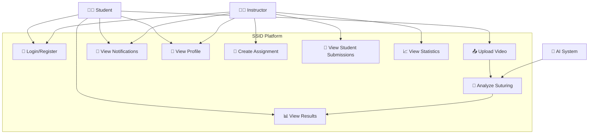
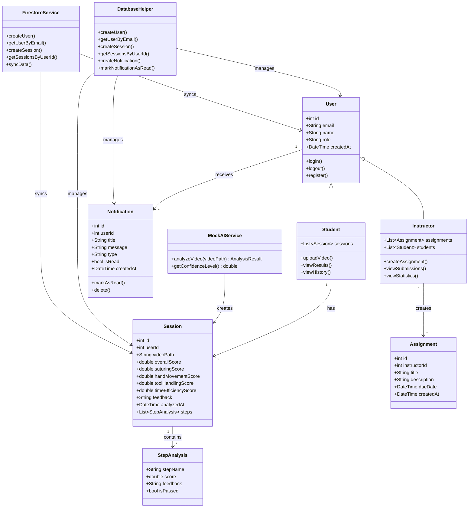
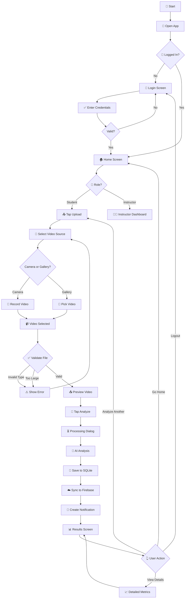
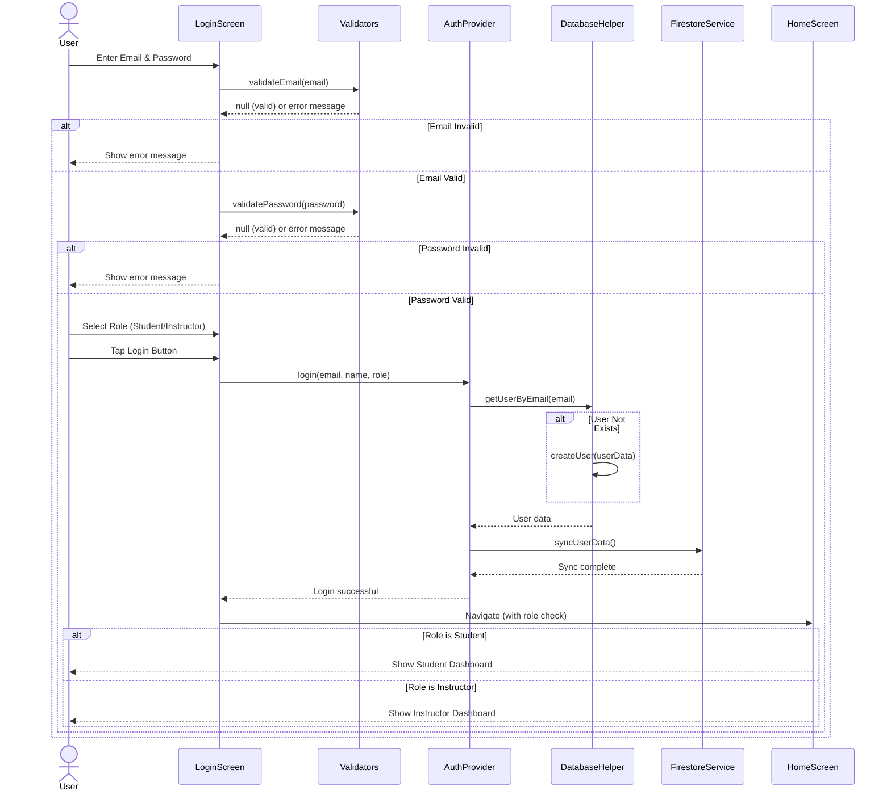
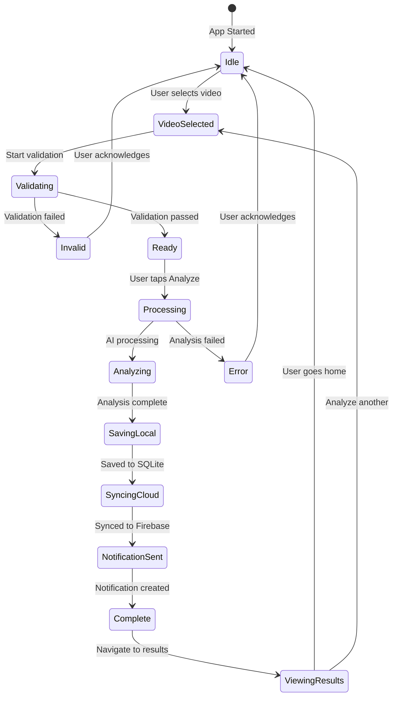

# SSID App - UML Diagrams

## 📊 System Design Documentation

---

## 1. Use Case Diagram

### Use Case Descriptions

| Use Case | Actor | Description |
|----------|-------|-------------|
| Login/Register | Student, Instructor | ผู้ใช้สามารถเข้าสู่ระบบด้วย Email/Password และเลือก Role |
| Upload Video | Student | อัปโหลดวิดีโอการฝึกเย็บแผลจาก Gallery หรือ Camera |
| Analyze Suturing | AI System | ระบบ AI วิเคราะห์เทคนิคการเย็บแผลจากวิดีโอ |
| View Results | Student | ดูผลการวิเคราะห์ ได้แก่ คะแนน, กราฟ, และ Feedback |
| View Notifications | Student, Instructor | ดูการแจ้งเตือนต่างๆ เช่น ผลวิเคราะห์, งานใหม่ |
| View Profile | Student, Instructor | ดูและแก้ไขข้อมูลโปรไฟล์ |
| Create Assignment | Instructor | สร้างงานมอบหมายให้นักศึกษา |
| View Student Submissions | Instructor | ดูงานที่นักศึกษาส่งมาและผลการวิเคราะห์ |
| View Statistics | Instructor | ดูสถิติภาพรวมของนักศึกษาทั้งหมด |

---

## 2. Class Diagram

### Class Descriptions

| Class | Responsibility |
|-------|---------------|
| **User** | Base class สำหรับผู้ใช้งาน มี email, name, role |
| **Student** | สืบทอดจาก User, สามารถอัปโหลดวิดีโอและดูผลวิเคราะห์ |
| **Instructor** | สืบทอดจาก User, สามารถสร้างงานและดูผลงานนักศึกษา |
| **Session** | เก็บข้อมูลผลการวิเคราะห์แต่ละครั้ง |
| **StepAnalysis** | เก็บข้อมูลการวิเคราะห์แต่ละขั้นตอน |
| **Notification** | เก็บข้อมูลการแจ้งเตือน |
| **Assignment** | เก็บข้อมูลงานที่มอบหมาย |
| **MockAIService** | จำลองการวิเคราะห์ด้วย AI |
| **DatabaseHelper** | จัดการ SQLite database |
| **FirestoreService** | จัดการ Firebase Firestore |

---

## 3. Activity Diagram - Video Analysis Flow

### Activity Flow Description

| Step | Screen | Action | Next |
|------|--------|--------|------|
| 1 | Splash | แสดง Logo 3 วินาที | Login/Home |
| 2 | Login | กรอก Email/Password + เลือก Role | Home |
| 3 | Home | ดู Dashboard + กดปุ่ม Upload | Upload |
| 4 | Upload | เลือก Camera หรือ Gallery | Select Video |
| 5 | Upload | Validate file type + size | Preview/Error |
| 6 | Upload | กดปุ่ม Analyze | Processing |
| 7 | Processing | แสดง Loading + AI ทำงาน 3-5 วินาที | Results |
| 8 | Results | แสดงคะแนน + กราฟ + Feedback | Home/Upload |

---

## 4. Sequence Diagram - Login Process

---

## 5. State Diagram - Session States

### State Descriptions

| State | Description |
|-------|-------------|
| Idle | ผู้ใช้อยู่ที่หน้า Home พร้อมเริ่มกระบวนการใหม่ |
| VideoSelected | เลือกวิดีโอแล้ว พร้อม validate |
| Validating | กำลังตรวจสอบ file type และ size |
| Invalid | Validation ไม่ผ่าน ต้องเลือกไฟล์ใหม่ |
| Ready | พร้อมส่งวิเคราะห์ |
| Processing | กำลังประมวลผลวิดีโอ |
| Analyzing | AI กำลังวิเคราะห์ |
| SavingLocal | บันทึกลง SQLite |
| SyncingCloud | Sync ขึ้น Firebase |
| NotificationSent | สร้างการแจ้งเตือนเสร็จสิ้น |
| Complete | กระบวนการเสร็จสิ้น |
| ViewingResults | ผู้ใช้กำลังดูผลลัพธ์ |
| Error | เกิดข้อผิดพลาด |

---

## Summary

เอกสารนี้ประกอบด้วย UML Diagrams ทั้ง 5 ประเภท:

1. **Use Case Diagram** - แสดง actors และ use cases ของระบบ
2. **Class Diagram** - แสดงโครงสร้าง classes และความสัมพันธ์
3. **Activity Diagram** - แสดง flow การทำงานของการอัปโหลดและวิเคราะห์วิดีโอ
4. **Sequence Diagram** - แสดงลำดับการทำงานของ Login process
5. **State Diagram** - แสดง states ต่างๆ ของ Session

ไฟล์นี้ตอบโจทย์ข้อกำหนด:
> "มี Design ที่เป็น User Case / Class / Activity / sequence / state อย่างน้อย 3 ไดอะแกรม"
